# Scikit-learn  Software Architecture Report


<div align="center"></div>

<b>Proudly provided by Hu Longchen , Zheng Bowen, Xiao Jingyu, Huang Yukun.</b>

- [Scikit-learn  Software Architecture Report](#scikit-learn--software-architecture-report)
  * [Abstract](#abstract)
    + [Demo](#demo)
  * [1.Introduction](#1introduction)
  * [2.Stakeholders](#2stakeholders)
    + [2.1 Stakeholders Analysis](#21-stakeholders-analysis)
     - [Core team members & contributors](#core-team-members---contributors)
     - [Additional stakeholders](#additional-stakeholders)
    + [2.2 Power-interest grid](#22-power-interest-grid)
  * [3. System Quality Attribute Analysis](#3-system-quality-attribute-analysis)
  * [4. Context View](#4-context-view)
    + [4.1 Design Philosophy](#41-design-philosophy)
    + [4.2 Environment Analysis](#42-environment-analysis)
  * [5. Development View](#5-development-view)
    + [5.1 Codeline Organization](#51-codeline-organization)
    + [5.2 Module Structure Model](#52-module-structure-model)
  * [6. Deployment View](#6-deployment-view)
    + [6.1 Dependencies](#61-dependencies)
    + [6.2 Environment/Runtime Environment](#62-environment-runtime-environment)
    + [6.3  Specialist Knowledge](#63--specialist-knowledge)


## Abstract

Scikit-learn was started in 2007 as a Google Summer of Code project by David Cournapeau. It is a tool for machine learning in the Python language. Due to its simplicity and efficiency, it has been one of the most used libraries in machine learning. As an open-source project, there are many developers contributing and keeping it growing. So, we decide to do a stakeholder analysis to figure out the aspect of its development members. Then, we describe scikit-learn from various viewpoints to show off its software architecture. In order to understand the project comprehensively, we do analysis of technical and testing debt in the end of chapter.

### Demo

```python
import numpy as np
import pandas as pd
import matplotlib.pyplot as plt
import sklearn
from sklearn.datasets import load_boston
boston = load_boston()

from sklearn.linear_model import LinearRegression

bos = pd.DataFrame(boston.data)
bos.columns = boston.feature_names
bos['PRICE'] = boston.target
bos.head()

X = bos.drop('PRICE', axis=1)
lm = LinearRegression()
lm.fit(X, bos.PRICE)

print('线性回归算法w值：', lm.coef_)
print('线性回归算法b值: ', lm.intercept_)

import matplotlib.font_manager as fm
myfont = fm.FontProperties(fname='C:/Windows/Fonts/msyh.ttc')
plt.scatter(bos.RM, bos.PRICE)
plt.xlabel(u'住宅平均房间数', fontproperties=myfont)
plt.ylabel(u'房屋价格', fontproperties=myfont)
plt.title(u'RM与PRICE的关系', fontproperties=myfont)
plt.show()
```

 <div align=center> 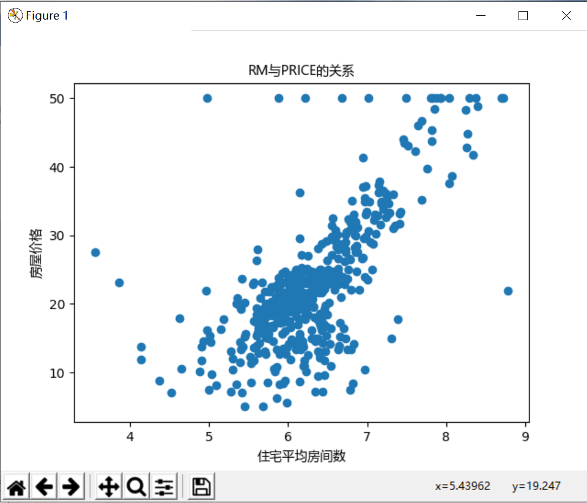<br>
 <center>Figure 0.1</center></div>

 <div align=center>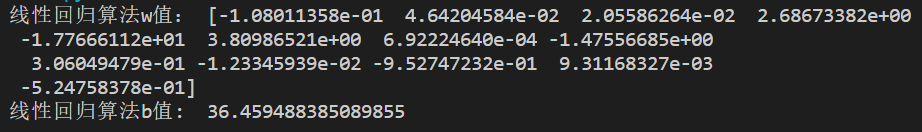<br>
 <center>Figure 0.2</center></div>
 
 
## 1.Introduction


Scikit-learn is a classical algorithm frame, which begins from Google Summer of Code in 2007. It’s a simple and efficient library and supplies many algorithms for unsupervised training and supervised training to
finish data mining and analysis. Its algorithm almost includes all fields of machine learning, which indicates the importance of the project. The algorithm library is based on Scipy so that you must download Scipy before using scikit-learn. Besides, the frame also has Numpy, matlibplot, IPython, Sympy and Pandas as dependence. Comparing to another famous algorithm frame, tensorflow, scikit-learn pays more attention to the module of algorithms. It’s convenient to use functions or modules in scikit-learn.The basic functions of Scikit-learning are divided into six parts: classification, regression, clustering, data dimensionality reduction, model selection and data preprocessing.


## 2.Stakeholders

### 2.1 Stakeholders Analysis

#### Core team members & contributors

In this section, According to Wikipedia,Stakeholder means an group,corporate,organization,member,or system that affects or can be affected by an organization’s actions. We explain it referred to Rozanski           and Woods' book and classified it into those categories:

|Stakeholders|Description|Quality Attribute|
| ---- | ---- | ---- |
| Acquirers|Acquirers are always connected with acquisition that is an economic activity through which a company acquires a degree of control over another company in order to achieve an economic goal. For scikit-learn,acquirers offer the needed funding for the development of the system and maybe need to make a decision about purchasing the it and profit from it .Some of the examples are Columbia University,Google and INRIA. | Acquirers need the system run normally as long as possible,the main quality attributes they concern are performance,usability,reliability,continuous availability and robustness. |
| Assessors| Assessors evaluate and demonstrate the plan to decide whether to adopt or not. For scikit-learn,assessors evaluate whether the operation of the system meets the requirements and conforms to the law,and whether it is beneficial to the development of the system when there are some advice about the system. All in all,they need to decide if those advice are meant to applied. Examples in this system : Decisions about the future of the project are made through discussion with all members of the community. All non-sensitive project management discussion takes place on the project contributors’ [mailing list](mailto:scikit-learn@python.org) and the [issue tracker](https://github.com/scikit-learn/scikit-learn/issues). Occasionally, sensitive discussion occurs on a private list. | Assessors need to evaluate the possible decisions like new functions of the system,so they may concern more about the modifiability and scalability in all those quality attributes. |
| Communicators| Communicators are responsible for talking with others including explaining, teaching, negotiating, responding. Everything associated with outward words are about communicators. For scikit-learn,communicators are responsible for explaining the functions of the system to others and helping others install and operate the system. In the same time,they need to write and use documentation, official documentation, API documentation, etc. Examples in this system: members of the community, users like college students of the system who will introduce the system to their friends and connected companies. | Communicators need to understand and explain the system,so they pay more attention on understandability,usability and continuous availability. |
| Developers| Developers are the main group for the specific software development,they are responsible for the whole procedure of the system from idea,designing,developing and modifying. For scikit-learn,The developers need to identify every detail of the software and develop the complete system from a vague concept. Also they need to confirm the system that it can operate normally after all the developing things. Examples in the system: Thomas J Fan,Alexandre Gramfort,Olivier Grisel.etc. | Developers are the main part of the system,they need to be concern with many attributes like understandability,reusability,portability,interoperability and safety. |
| Maintainers| Maintainers’ main job is about software modifications that are made after the release of a product to improve performance or other attributes due to bug fixes. For scikit-learn,Maintainers are aimed at the daily maintenance of scikit-learn to ensure the normal operation of software and emergency backup recovery and other measures like system maintenance, regular inspection, whether the software is normal operation, regular backup, clean up garbage information and so on,or maybe sometimes algorithm need to improved,which is also the job of maintainers. Examples in the system: the job is mainly performed by Andreas Müller,with some others who are willing to maintain the documentation and code of the library in GitHub. | As the logistical support of the system,maintainers need to pay attention to maintainability and scalability. |
| Production engineers | The main task of the production engineer is to make the process smooth and smooth, ensure that every gear in the production process is closely connected, so that the product can be launched according to the schedule, and even shorten the time from design to mass production, so as to win more market. For scikit-learn,production engineers generally belong to the category of technology department who are responsible for product technical support of the system. In some way,they need to adjust the environment of the hardware and software to ensure the normal running. Examples in the system: Andreas Müller as a release manager,is to do the mainly manage work. Also some staff in the companies who use scikit-learn and some volunteers in the GitHub help a lot.|Production engineers need to consider the environment and interaction of the system,so they are concerned about safety and interoperability.|
| Suppliers|Suppliers are those people or company who offer the sufficient support to a project. For scikit-learn,suppliers offer hardware and software to the development of the system. Some of them offer people and platform,some offer technology to help build environment,others offer software to test the algorithm,etc. Examples in the system: Rackspace provide with a free [Rackspace Cloud](https://www.rackspace.com/cloud/) account to automatically build the documentation with the example gallery;[Shining Panda](http://shiningpanda.com/) provide free CPU time on their Continuous Integration server.|Suppliers offer the necessary device supply of the system who need to know the system very well,so they pay more attention to the interoperability and portability.|
| System administrator |The system administrator is mainly responsible for the design, installation, configuration management and maintenance of the network equipment and server system of the entire network. Also,they are responsible for the daily management and maintenance of the specific information system, with the highest management authority of the information system. For scikit-learn,system administrator need to help users to run this python software at the very system they want. Examples in the system: Adrin Jalali,Guillaume Lemaitre are the main administrator of the system. |System Administrator are with the multi-platform of the system,so they are concerned about the portability,usability and understandability.|
| Testers|Testers are responsible for the process of operating a program under specified conditions to detect program errors, measure software quality, and evaluate whether it meets design requirements. For scikit-learn,testers are not only means some people who test databases and algorithm or other conventional functions,but also some devices or programs that can help test without people. Examples in the system: continuous integration tools like Jenkins will help people in community to test all the needs.|Testers need to have a periodic tests about the system,so the most important quality attribute for them is testability,in addition to this,they also concern about the scalability and reusability etc.|
| Users|Users,are persons who uses a computer or Internet service,also companies or some scientific group may also be the users,which is a broad concept. For scikit-learn,users are those who operate system by them selves or may take advantage of the system to help analyze the date. Due to scikit-learn is a system of  python,the users of it are from the every aspect about the Internet. Examples in the system: Individual users in computer programming;college students who are in the scientific group;college management in Wuhan university.|Users are the people or group who operate the system,so the usage experience is the most important part for them. On this basis, they pay more attention about the performance and usage above all quality attributes.|


#### Additional stakeholders

Except for the main stakeholders of the method proposed by Rozanski & Woods,there are lots other stakeholders which are also really important. Here are those categories:

|Stakeholders|Description|Quality Attribute|
| ---- | ---- | ---- |
|Contributors      |Contributors are those who support the specific project with their money,physical power,wisdom or anything else.For scikit-learn,contributors are the largest group,some of whom support it with money,some of whom join the GitHub to manage the code and write the document,others help maintain the code or even in the class of the development.Examples in the system: Volunteers in the GitHub who join the code and have a raising; Big company like INRIA have a funding to the system,etc.|For different kinds of contributors have different concerns about those quality attributes,here are the conditions. For money-basis contributors,they are like acquirers who are more concerned about performance,usability,reliability,continuous availability and robustness. But for contributors who support with codes,they may pay attention to understandability, reusability, portability, interoperability and safety.      |
|Funders      |Funders are those who give a supporting to the development of the project,the supporting maybe material or spiritual.For scikit-learn,funders always offer the sufficient money support to help the development of the system,or the right of use of some device to help test or running. In return,they can get the right to use the product ahead of schedule or some percentage profit of the money gained by the product or some other benefit.Examples in the system:[INRIA](https://www.inria.fr/) actively supports this project;[Columbia University](https://columbia.edu/) funds Andreas Müller since 2016;[The University of Sydney](https://sydney.edu.au/) funds Joel Nothman since July 2017,etc.      | Funders are those who wish their funds have corresponding return,so they pay attention about performance,usability,reliability and robustness.     |
|Competitors      |Competitors generally refer to other enterprises that provide similar products or services and serve similar target customers. For scikit-learn,competitors are other system who provided the similar machine learning algorithm libraries which can get to the same outcome with it. Examples in the system: GraphLab,which is a library in C++.|Competitors always wants to find the advantages and disadvantages of the system,so they are concerned about almost all quality attributes,but some of them may be more important like understandability,scalability,reusability,testability,portability and maintainability etc.       |

 
<div align="center">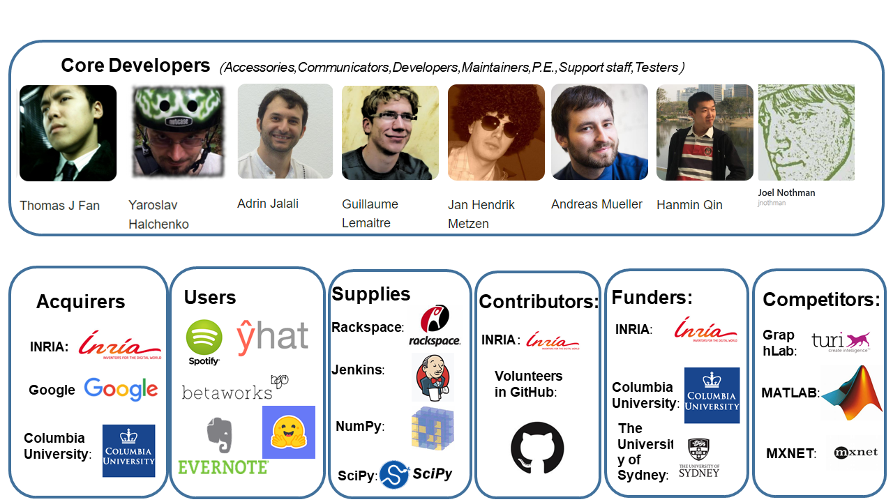</div>

<div align="center">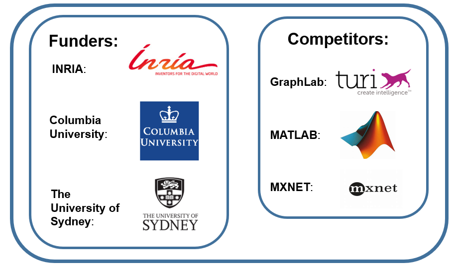<br>
<center>Figure 2.1  Stakeholders of Scikit-Learn</center></div>

<div align="center">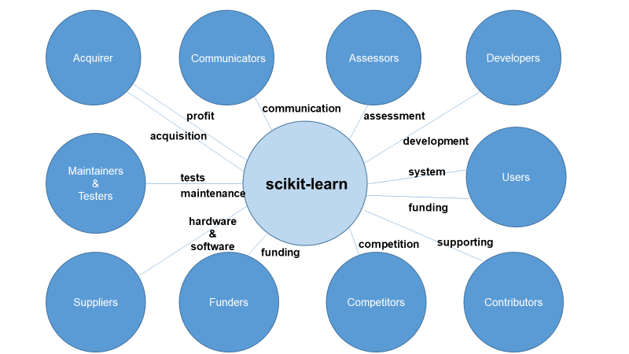<br>
<center>Figure 2.2 The connect between sklearn and stakeholder</center></div>

### 2.2 Power-interest grid


Figure 2.4 shows the quadrants of power and interest of scikit-learn stakeholders. The x-axis determines interest of stakeholders to scikit-learn which is divided into low and high interest. The interest of stakeholders is demonstrated by the profit which they can get from the project. The y-axis determines the power of stakeholders which is also divide into low and high power. Power is related to how influential the stakeholder is in scikit-learn's past, current, and future development.


In Figure 2.3, I divide the stakeholders into fours parts.

Core Developers: I think they should be “Manage Closely”, because the project is almost developed by them. They have rights and responsibility and may get profits from it. So, the interest and power of them must be high

Acquirers: They make decisions, offer the needed funding and profit from the project. The interest and power of them are also high.

Users: Comparing to other roles, user may have low power for the project. Because they are a broad concept. But as users, they are willing to use the project, so the interest of them must be high.

Suppliers: They offer the sufficient support for the project. But the suppliers are not a positive role which means the support may be not launched by them. So I think the power of them should be high and interest of them should be low.

Contributor: They support money, some of whom manage the code and write the document. I also think they have high power, and high interest.

Funders: They can get right to use the product and profit of money gained but the product. So, they have high power and interest.

Competitors: I think the competitors have low power because they can’t decide for the project directly. However, the interest may have high interest because the similar project may give them some idea and they are willing to use and explore the scikit-learn.


Github: GitHub is stakeholder that have no control over the management of Scikit-learn, nor do they directly benefit from it.


The following figure shows the power versus interest relation of the stakeholders of the Scikit-Learn:

<div align="center">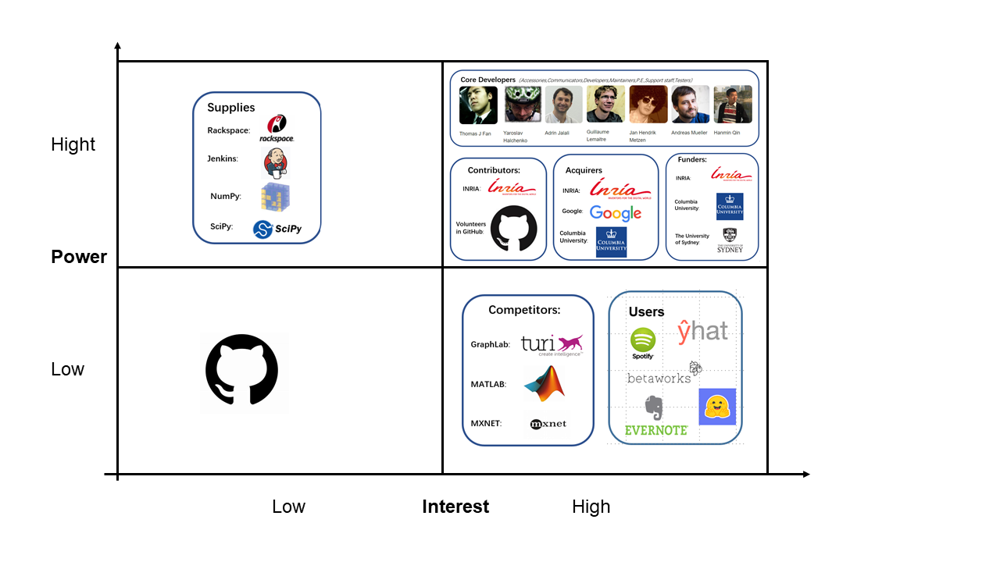<br>
<center>Figure 2.3  Power interest grid of Scikit-Learn</center></div>


The following figure shows the how we treat the stakeholders in difference quadrants:

<div align="center">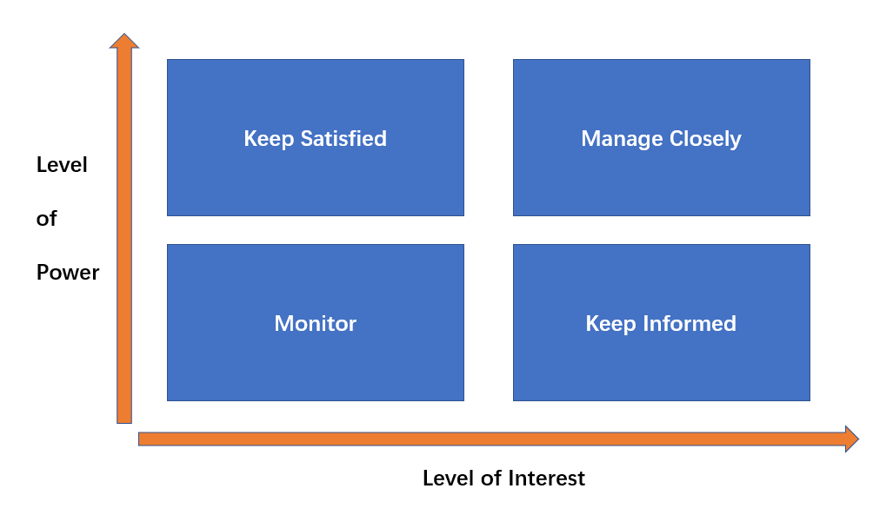<br>
<center>Figure 2.4  Power interest grid</center></div>


## 3. System Quality Attribute Analysis

The most important attributes for users：

• 有效性（availability） 

• 高效性( efficiency) 

• 灵活性( flexibility ) 

• 完整性(integrity)

• 互操作性( interoperability ) 

• 可靠性( reliability ) 

• 健壮性( robustness ) 

• 可用性( usability


The most important attributes for developers：

• 可维护性( maintainability ) 

• 可移植性( portability ) 

• 可重用性( reusability)

• 可测试性( testability )


Sklearn is not a software architecture for mass users, but for developers with machine learning development requirements. The following is an analysis of the importance of quality attributes:

<div align="center">table 3.1</div>

| Object    | Quality Attribute | Description                                                  | Importance Degree |
| --------- | ----------------- | ------------------------------------------------------------ | ----------------- |
| User      | Usability         | I think usability is the most important attribute for   users. Sklearn provides a series of APIs for developers (i.e. users). Whether   developers will use sklearn framework depends on whether they can quickly get   familiar with calling a series of APIs of sklearn to complete machine   learning tasks. | ⭐⭐⭐⭐⭐             |
| User      | efficiency        | Efficiency, I think, is as important as availability.   Users expect sklearns to produce clustering, regression, and decision-making   results soon. | ⭐⭐⭐⭐⭐             |
| User      | flexibility       | Flexibility is important because as research progresses,   there will be many new machine learning algorithms and models. Sklearns need   to keep up with the pace of iteration to meet user needs. | ⭐⭐⭐⭐              |
| User      | reliability       | Reliability is necessary to ensure the correctness of  machine learning algorithm | ⭐⭐⭐               |
| User      | Availability      | Sklearns can be invoked by developers at any time.   Effectiveness is less important. | ⭐⭐                |
| User      | Integrity         | Sklearns do not involve user-related information   operations and do not need to care too much about reliability. | ⭐⭐                |
| User      | robustness        | The premise of using sklearn is that the relevant   operators are already familiar with the API calls, the familiar people can   ensure the correctness of the parameters passed, and the incorrect compiler   will prompt related errors in time, so robustness is not so important. | ⭐⭐                |
| User      | interoperability  | Because sklearn users are specialists in machine learning   and development, and do not involve GUI and human-computer interaction,   interoperability is less important. | ⭐⭐                |
| Developer | maintainability   | Maintainability indicates how easy it is to correct a   defect or make a change in software. Because sklearn is a big framework, some   mistakes may lead to catastrophic consequences, and also many people   contribute to the project. So I think maintainability is the most important   quality attribute. | ⭐⭐⭐⭐⭐             |
| Developer | portability       | Portability is not a concern of developers. Python   language has good portability (Python can run across operating platforms,   that is, the core language and standard library of Python program can run on   Linux, Windows and other platforms with Python interpreter without any   difference). ) It ensures that sklearn has good portability. | ⭐⭐⭐⭐              |
| Developer | reusability       | In terms of the long-term goal of software development,   reusability indicates the extent to which a software component can be used in   other applications in addition to the original system. Because different   algorithms in machine learning may use the same basic computation. For   example, the maximum and minimum clustering and K-means clustering in   clustering will use Markov distance and Euclidean distance to calculate.   Reuse this part of the code to make the system redundant | ⭐⭐⭐⭐              |
| Developer | testability       | Because all three of the above quality attributes can   promote testability, the focus on testability is less important. | ⭐⭐⭐               |

Sometimes, it is inevitable to make a trade-off between certain attributes. Users and developers must determine which attributes are more important than others and prioritize them. When they make decisions, they should always follow those priorities. Figures describe some typical relationships between quality attributes：

**Red indicates that the attributes of the row in which the cell is located increase the negative impact on the attributes of the column in which it is located.**

**Green indicates that the attributes of the row in which the cell is located increase the positive impact on the attributes of the column in which it is located.**

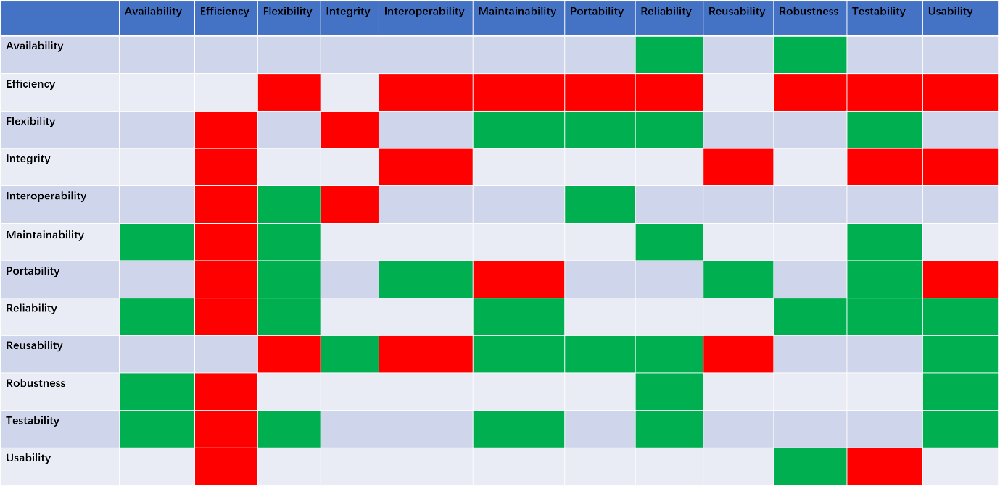

<div align="center">Figure 3.1 Some typical relationships between quality attributes</div>

## 4. Context View

This section contains the relationship between scikit-learn and other related entities. First we will give the design philosophy of it and then, we can understand the relationship between scikit-learn and environment
better.

### 4.1 Design Philosophy

1. Consistence: All interfaces are consistence and simple. The interfaces can be divided as three classes as below:

a)       Estimator: Any objects which can give an estimate for data can be regarded as an estimator. It 

b)       Transformer: Some estimators which are used to transfer data set can be regarded as transformer. It accepts a data set and returns a data set.

c)       Predictor: Some estimators can give prediction for a data set which are called predictor.

2. Checkable: All super-parameters and parameters in learning of estimators can be access by public attributes of instance.

3. Strict class definition: the class of data set is from numpy or scipy. The scikit-learn doesn’t support specific data type which promises the stable of model.

4. Reuse: Try to use existing models to finish task. For example, users can use some any transformers and a predictor to form a pipeline.

 

We can learn that the main target of scikit-learn is to make user understand the project better. The consistence of it make sure that there is a common concept for users. The checkable parameters can help users figure out the details of machine learning and strict class definition reduce the complexity of the project. Last, the reuse models make the development simple and various.


### 4.2 Environment Analysis

Figure 4.1 show that the relationship between scikit-learn and its environment. There are seven related entities which stand for two types. One type is connection between scikit-learn and some organizations, like WHU or NYU. Another type is from software aspect. For example, software dependency or version control tools, like numpy or GitHub. The length of lines between them and scikit-learn represents the closeness of connection. For instance, user, developer and software dependency should be closest to scikit-learn. To contrary, competitor may have less connection with it.

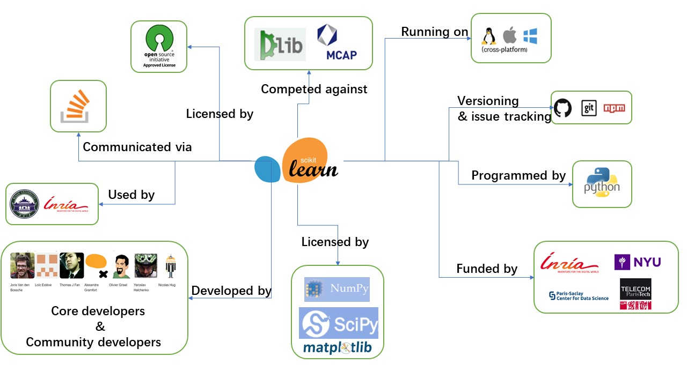

<div align="center">Figure 4.1 Environment relationship of scikit-learn</div>


Figure 4.1 show that the relationship between scikit-learn and its environment. 
With this figure, we can clearly see external entities of scikit-learn.
scikit-learn is...  
- programmed in: Python
- developed by: core developers & community developers
- versioning&issue tracking: Git, GitHub, npm
- running on: Windows, OS X, Linux（cross-platform）
- dependencies: Numpy, Scipy, Matplotlib
- communicated via: StackOverflow
- licensed by：BSD 3-Clause
- used by：students of Wuhan university and other universities, Inria ...
- competed against：Dlib, Mcap...
- funded by: Inria, NYU, Paris-Saclay Center for Data Science, Télécom Paristech...


## 5. Development View

This section gives an overview of the structure of the Scikit-learn project from the perspective of the developers. The development view is what gives developers (and testers) a bird eye view of the architecture. It should not be too detailed or descriptive, but still cover the most important bases. The development viewpoint discussed here is about scikit-learn's module structure model and codeline organization.


### 5.1 Codeline Organization

The scikit-learn source files are organized based on their functionalities. 

The main machine learning algorithms are encapsulated in the *sklearn* folder.  Each sub-folder of sklearn (such as cluster) contains an algorithm, which includes the algorithm's .py file, .pyx file (a Cython file), and a test folder. In the test folder are the test algorithm’s .py files.  

In the *examples* folder, there are demos and running results for various algorithms for users to preview. Each subfolder includes .py files and a documentation.  

The *doc* folders contains various materials, images, data, update information and developer lists referenced by sklearn. Most data files are saved in .rst files. 

 In the *benchmarks* folder, all of the .py files are for computing presets and benchmarks.

 In the *build_tools* folder, it contains the shell scripts in the Linux environment of different build tools(circle, travis and azure). 

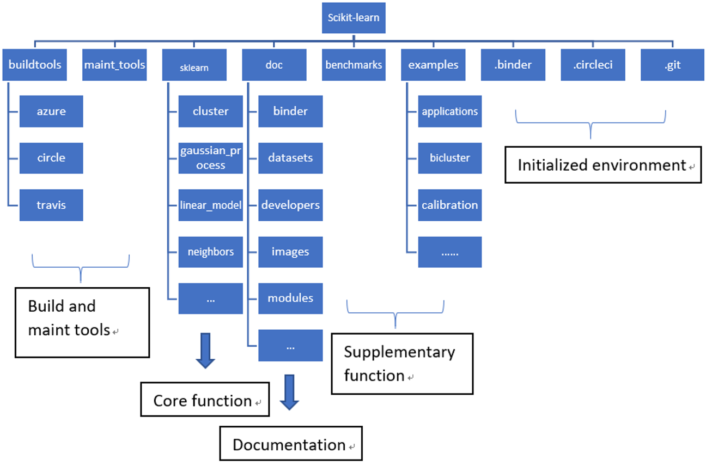

<div align="center">Figure 5.1 The file distribution tree</div>


### 5.2 Module Structure Model

The module structure model defines the organization of the system's source code and related external systems, in terms of the modules into which the individual source files are collected and the dependencies among these modules. In Figure layers are identified for scikit-learn With each layer consisting of one or more module(s). These layers are:

Domain layer: This layer corresponds to the sklearn folder and the various algorithms encapsulated in it.

Utility layer: Consisting of modules that support basic functionality that can be used in domain layer.

Platform layer: It contains modules for required packages, such as python, NumPy, SciPy and MatPlotLib.

Build tool layer, which contains build modules to build the library. Each module consists of files to download, install, testing, or setting the required library. 

Dependency of one layer to the other layer(s) is proven by an arrow which points to the destination of the required layer. As an example, the utility layer uses all libraries available from python, NumPy, SciPy, and MatPlotLib by importing them in the module. In addition, there are explicit intermodule dependencies for all modules in the domain layer for python because all files under each module requires python. 

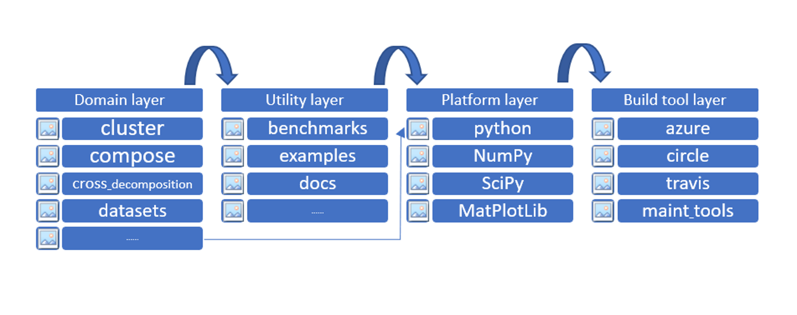

<div align="center">Figure 5.2 The Module Structure</div>


## 6. Deployment View

The deployment view is used to show the physical architecture of the software and hardware in the system. From the deployment view, we can see the physical relationship between software and hardware components and the component distribution of the processing nodes. Deployment view shows the structure of the runtime system, as well as convey the configuration and deployment of the hardware and software elements that make up the application.For scikit-learn,we will take three aspects:its dependencies,environment/runtime environment and required specialist knowledge to analyse its deployment view.


### 6.1 Dependencies

Users need some basic environment and program support to install and use scikit-learn normally,which related to the development language, environment, and process of the system itself.It includes:

A.  Basic installation requirements

·Python(>=3.5),Users of scikit-learn will need support from the new version of python.

·NumPy(>=1.11.0),The higher version of NumPy provides python with an efficient extension of numerical computation to store and process large matrices.

·SciPy(>=0.17.0),It is used to effectively compute NumPy matrix, enabling NumPy and SciPy to work together and solve problems efficiently.

·joblib(>=0.11),It provides an easy way to serialize objects that contain large data arrays and can also be used to store data models.

B.  Scikit-learn drawing function (the function starts with "plot_" )requires Matplotlib(>= 1.5.1). Some scikit-learn examples may require one or more additional dependencies :scikit-image(>= 0.12.3), panda(>= 0.18.0)

C.   Users can use **conda** or **pip** to include the scikit-learn and NumPy,SciPy(Installed on PyPy, it will need pypy3-v5.10 +, Numpy 1.14.0+, and scipy 1.1.0+)

D.  User can also use [**Canopy**](https://www.enthought.com/products/canopy) and [**Anaconda**](https://www.continuum.io/downloads) to Enrich some useful scikit-learn libraries

E.   WinPython is a useful component that provides simplified operations and smoother computing for Windows operating systems.


### 6.2 Environment/Runtime Environment

Runtime Environment,is also called run-time system.which is an environment in which a semi-compiled runtime code is run on a target machine.The runtime environment contains the necessary support to enable the system to run, enabling users to achieve their goals through a series of operations using the system.In scikit-learn,users can conduct machine learning related seminars and studies, and can conduct normal data mining and data communication.For scikit-learn runs with python,the environment of it is not that complex and can be defined by its transplanted host machine.It may include:

A.  All the dependencies above.For the dependencies are the basic support for the system to run,without which scikit-learn is just a shell.

B.  A specific device/machine with the python support,the machine can be a host or pc or mobile phone,pad etc.It needs to have a processor or mini processor to have ability to do some calculation(with necessary storage and RAM and ROM or a little flash memory )

C.   Some operating system may have different effect to the system.For example.windows may be the best system for scikit-learn,for it also offer some additional component and tool package for user to do it more easily.Mac OS or Linux are also applicable,its component may be added in the next edition.

Except all those environments above,the actual running environment is relevant to the different machines of each user.Perhaps the environment variable configuration of other software will affect the use of scikit-learn,or some version of the environment may conflict with the computer system,or errors may occur due to configuration differences during use.So users in the above environment should also be based on the actual machine fine-tuning operation.


### 6.3  Specialist Knowledge

For scikit-learn is a professional system with high level machine learning knowledge.It is positioned as a simple and efficient tool for data mining and data analysis.So users who want to use it for some personal or academic or commercial use,he must have the necessary knowledge.People who have the knowledge will be the dominant person in the academic work in a group or the popular one who may be more likely appointed the head of the company in a specific scikit-learn project.Here are some sufficient knowledge.

A.  Machine learning.Machine learning studies how computers simulate or implement human learning behavior in order to acquire new knowledge or skills and reorganize the existing knowledge structure so as to continuously improve its own performance.For scikit-learn is exactly the tool with high level machine learning which includes Supervised learning,classification,regression,Unsupervised learning etc.Knowing knowledge like neural network techniques,  k-means will help a lot.

B.  Higher mathematics,which is the basic math theory for all those calculations.Being good at this will shorten the design of the algorithm.

C.   Linear algebra.scikit-learn project have a lot with matrix calculation,it can be calculated with the python package but also need to be designed with some basic knowledge.Except this,linear space and linear return etc. are also useful and are the basic theory of other subject.

D.  Probability theory.When users need to calculate some probability issues while he is doing data mining,this subject is really useful.With some theoretical basis of integration,user will feel easy to do things.

E.   Algorithm basic.Sometimes users will want to see the data sets or algorithm in the scikit-learn to help understand the principle of the system.Or he can write some algorithm to help academy data mining work.In this time,a good programmer with super algorithm ability will like a duck to water.

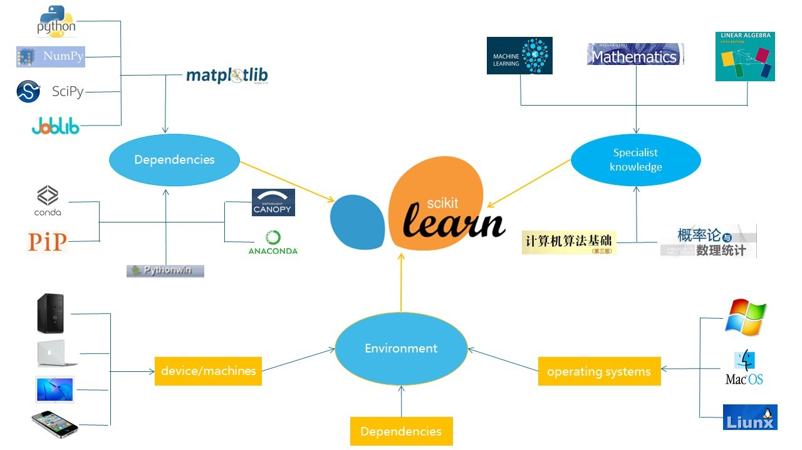

<div align="center">Figure 6.1 The deployment view for scikit-learn</div>
