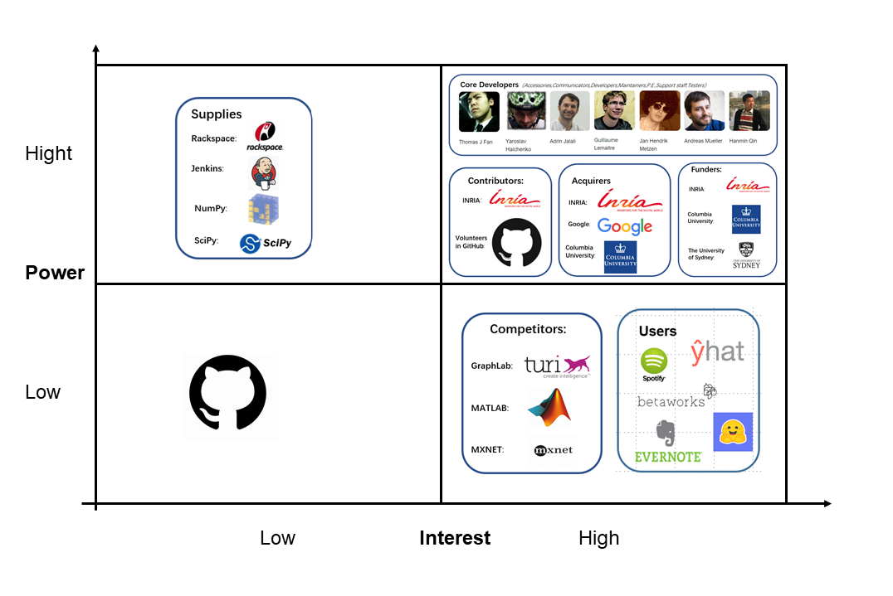

# Scikit-learn  Software Architecture Report

## Index

- Abstract
- Introduction
- Stakeholders
  - Core team members & contributors
  - Other contributors
  - Users
  - Competitors
- Context View 
- Development View
  - Module Structure Model
  - Source code structure
- Deployment View
  - Dependencies
  - Environment/Runtime Environment
  - Specialist Knowledge
- Functional View 
- Performance and Scalability Perspective 
- Technical Debt
  - Ambiguous Project Structure
  - Messy Module Dependencies
  - Code Inconsistencies
  - Low Code Coverage
  - ......
- Evolution Perspective 
- Conclusion
- References


## Abstract

Scikit-learn was started in 2007 as a Google Summer of Code project by David Cournapeau. It is a tool for machine learning in the Python language. Due to its simplicity and efficiency, it has been one of the most used libraries in machine learning. As an open-source project, there are many developers contributing and keeping it growing. So, we decide to do a stakeholder analysis to figure out the aspect of its development members. Then, we describe scikit-learn from various viewpoints to show off its software architecture. In order to understand the project comprehensively, we do analysis of technical and testing debt in the end of chapter.

### Demo

```python
import numpy as np
import pandas as pd
import matplotlib.pyplot as plt
import sklearn
from sklearn.datasets import load_boston
boston = load_boston()

from sklearn.linear_model import LinearRegression

bos = pd.DataFrame(boston.data)
bos.columns = boston.feature_names
bos['PRICE'] = boston.target
bos.head()

X = bos.drop('PRICE', axis=1)
lm = LinearRegression()
lm.fit(X, bos.PRICE)

print('线性回归算法w值：', lm.coef_)
print('线性回归算法b值: ', lm.intercept_)

import matplotlib.font_manager as fm
myfont = fm.FontProperties(fname='C:/Windows/Fonts/msyh.ttc')
plt.scatter(bos.RM, bos.PRICE)
plt.xlabel(u'住宅平均房间数', fontproperties=myfont)
plt.ylabel(u'房屋价格', fontproperties=myfont)
plt.title(u'RM与PRICE的关系', fontproperties=myfont)
plt.show()
```

 

 
 
 
## Introduction


Scikit-learn is a classical algorithm frame, which begins from Google Summer of Code in 2007. It’s a simple and efficient library and supplies many algorithms for unsupervised training and supervised training to
finish data mining and analysis. Its algorithm almost includes all fields of machine learning, which indicates the importance of the project. The algorithm library is based on Scipy so that you must download Scipy before using scikit-learn. Besides, the frame also has Numpy, matlibplot, IPython, Sympy and Pandas as dependence. Comparing to another famous algorithm frame, tensorflow, scikit-learn pays more attention to the module of algorithms. It’s convenient to use functions or modules in scikit-learn.The basic functions of Scikit-learning are divided into six parts: classification, regression, clustering, data dimensionality reduction, model selection and data preprocessing.


## Stakeholders Analysis

### Core team members & contributors

In this section, According to Wikipedia,Stakeholder means an group,corporate,organization,member,or system that affects or can be affected by an organization’s actions. We explain it referred to Rozanski           and Woods' book and classified it into those categories:

#### Acquirers

Acquirers are always connected with acquisition that is an economic activity through which a company acquires a degree of control over another company in order to achieve an economic goal.

For scikit-learn,acquirers offer the needed funding for the development of the system and maybe need to make a decision about purchasing the it and profit from it .Some of the examples are Columbia University,Google and INRIA. 

#### Assessors

Assessors evaluate and demonstrate the plan to decide whether to adopt or not.

For scikit-learn,assessors evaluate whether the operation of the system meets the requirements and conforms to the law,and whether it is beneficial to the development of the system when there are some advice about the system. All in all,they need to decide if those advice are meant to applied. Examples in this system : Decisions about the future of the project are made through discussion with all members of the community. All non-sensitive project management discussion takes place on the project contributors’ [mailing list](mailto:scikit-learn@python.org) and the [issue tracker](https://github.com/scikit-learn/scikit-learn/issues). Occasionally, sensitive discussion occurs on a private list.

#### Communicators

Communicators are responsible for talking with others including explaining, teaching, negotiating, responding. Everything associated with outward words are about communicators.

For scikit-learn,communicators are responsible for explaining the functions of the system to others and helping others install and operate the system. In the same time,they need to write and use documentation, official documentation, API documentation, etc. Examples in this system: members of the community, users like college students of the system who will introduce the system to their friends and connected companies.

#### Developers

Developers are the main group for the specific software development,they are responsible for the whole procedure of the system from idea,designing,developing and modifying.

For scikit-learn,The developers need to identify every detail of the software and develop the complete system from a vague concept. Also they need to confirm the system that it can operate normally after all the developing things. Examples in the system: Thomas J Fan,Alexandre Gramfort,Olivier Grisel.etc.

#### Maintainers

Maintainers’ main job is about software modifications that are made after the release of a product to improve performance or other attributes due to bug fixes.

For scikit-learn,Maintainers are aimed at the daily maintenance of scikit-learn to ensure the normal operation of software and emergency backup recovery and other measures like system maintenance, regular inspection, whether the software is normal operation, regular backup, clean up garbage information and so on,or maybe sometimes algorithm need to improved,which is also the job of maintainers. Examples in the system: the job is mainly performed by Andreas Müller,with some others who are willing to maintain the documentation and code of the library in GitHub.

#### Production engineers

The main task of the production engineer is to make the process smooth and smooth, ensure that every gear in the production process is closely connected, so that the product can be launched according to the schedule, and even shorten the time from design to mass production, so as to win more market.

For scikit-learn,production engineers generally belong to the category of technology department who are responsible for product technical support of the system. In some way,they need to adjust the environment of the hardware and software to ensure the normal running. Examples in the system: Andreas Müller as a release manager,is to do the mainly manage work. Also some staff in the companies who use scikit-learn and some volunteers in the GitHub help a lot.

#### Suppliers

Suppliers are those people or company who offer the sufficient support to a project.

For scikit-learn,suppliers offer hardware and software to the development of the system. Some of them offer people and platform,some offer technology to help build environment,others offer software to test the algorithm,etc. Examples in the system: Rackspace provide with a free [Rackspace Cloud](https://www.rackspace.com/cloud/) account to automatically build the documentation with the example gallery;[Shining Panda](http://shiningpanda.com/) provide free CPU time on their Continuous Integration server.

#### System administrator

The system administrator is mainly responsible for the design, installation, configuration management and maintenance of the network equipment and server system of the entire network. Also,they are responsible for the daily management and maintenance of the specific information system, with the highest management authority of the information system.

For scikit-learn,system administrator need to help users to run this python software at the very system they want. Examples in the system: Adrin Jalali,Guillaume Lemaitre are the main administrator of the system.

#### Testers

Testers are responsible for the process of operating a program under specified conditions to detect program errors, measure software quality, and evaluate whether it meets design requirements.

For scikit-learn,testers are not only means some people who test databases and algorithm or other conventional functions,but also some devices or programs that can help test without people. Examples in the system: continuous integration tools like Jenkins will help people in community to test all the needs.

#### Users

Users,are persons who uses a computer or Internet service,also companies or some scientific group may also be the users,which is a broad concept.

For scikit-learn,users are those who operate system by them selves or may take advantage of the system to help analyze the date. Due to scikit-learn is a system of  python,the users of it are from the every aspect about the Internet. Examples in the system: Individual users in computer programming;college students who are in the scientific group;college management in Wuhan university.


### Additional stakeholders

Except for the main stakeholders of the method proposed by Rozanski & Woods,there are lots other stakeholders which are also really important. Here are those categories:

#### Contributors

Contributors are those who support the specific project with their money,physical power,wisdom or anything else.

For scikit-learn,contributors are the largest group,some of whom support it with money,some of whom join the GitHub to manage the code and write the document,others help maintain the code or even in the class of the development.

Examples in the system: Volunteers in the GitHub who join the code and have a raising; Big company like INRIA have a funding to the system,etc.

#### Funders

Funders are those who give a supporting to the development of the project,the supporting maybe material or spiritual. In return,they can get the right to use the product ahead of schedule or some percentage profit of the money gained by the product or some other benefit.

For scikit-learn,funders always offer the sufficient money support to help the development of the system,or the right of use of some device to help test or running.

Examples in the system:[INRIA](https://www.inria.fr/) actively supports this project;[Columbia University](https://columbia.edu/) funds Andreas Müller since 2016;[The University of Sydney](https://sydney.edu.au/) funds Joel Nothman since July 2017,etc.

#### Competitors

Competitors generally refer to other enterprises that provide similar products or services and serve similar target customers

For scikit-learn,competitors are other system who provided the similar machine learning algorithm libraries which can get to the same outcome with it. Examples in the system: GraphLab,which is a library in C++.

 
<div align="center"><i></div>

<div align="center"><br><i><b>Figure1</b>  Power interest grid of Scikit-Learn</i></div>

<div align="center"><i><b>Figure2</b>  The connect between sklearn and stakeholder</i></div>


### Power-interest grid


Figure 3 shows the quadrants of power and interest of scikit-learn stakeholders. The x-axis determines interest of stakeholders to scikit-learn which is divided into low and high interest. The interest of stakeholders is demonstrated by the profit which they can get from the project. The y-axis determines the power of stakeholders which is also divide into low and high power. Power is related to how influential the stakeholder is in scikit-learn's past, current, and future development.


In Figure 3, I divide the stakeholders into fours parts.

Core Developers: I think they should be “Manage Closely”, because the project is almost developed by them. They have rights and responsibility and may get profits from it. So, the interest and power of them must be high

Acquirers: They make decisions, offer the needed funding and profit from the project. The interest and power of them are also high.

Users: Comparing to other roles, user may have low power for the project. Because they are a broad concept. But as users, they are willing to use the project, so the interest of them must be high.

Suppliers: They offer the sufficient support for the project. But the suppliers are not a positive role which means the support may be not launched by them. So I think the power of them should be high and interest of them should be low.

Contributor: They support money, some of whom manage the code and write the document. I also think they have high power, and high interest.

Funders: They can get right to use the product and profit of money gained but the product. So, they have high power and interest.

Competitors: I think the competitors have low power because they can’t decide for the project directly. However, the interest may have high interest because the similar project may give them some idea and they are willing to use and explore the scikit-learn.


Github: GitHub is stakeholder that have no control over the management of Scikit-learn, nor do they directly benefit from it.


The following figure shows the power versus interest relation of the stakeholders of the Scikit-Learn:

<div align="center"><br><i><b>Figure3</b>  Power interest grid of Scikit-Learn</i></div>


The following figure shows the how we treat the stakeholders in difference quadrants:

<div align="center"></div>
