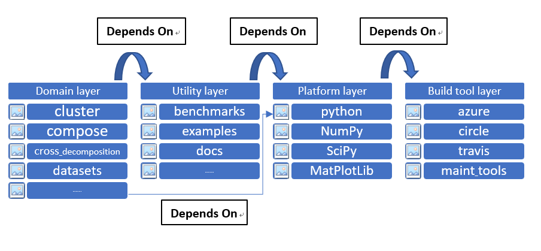
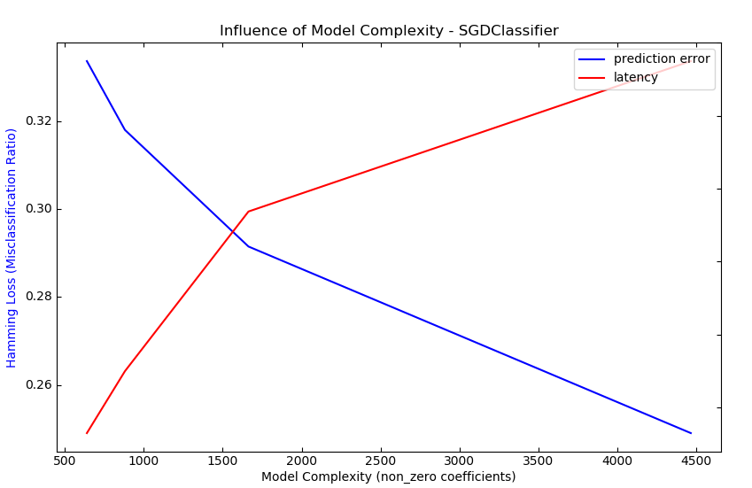
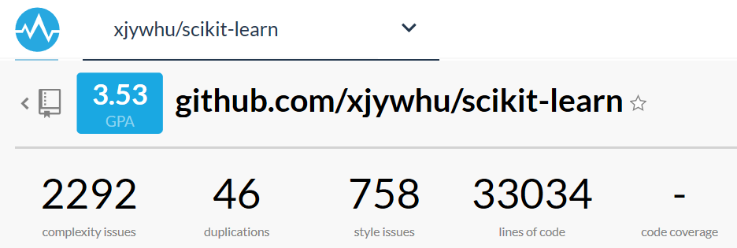
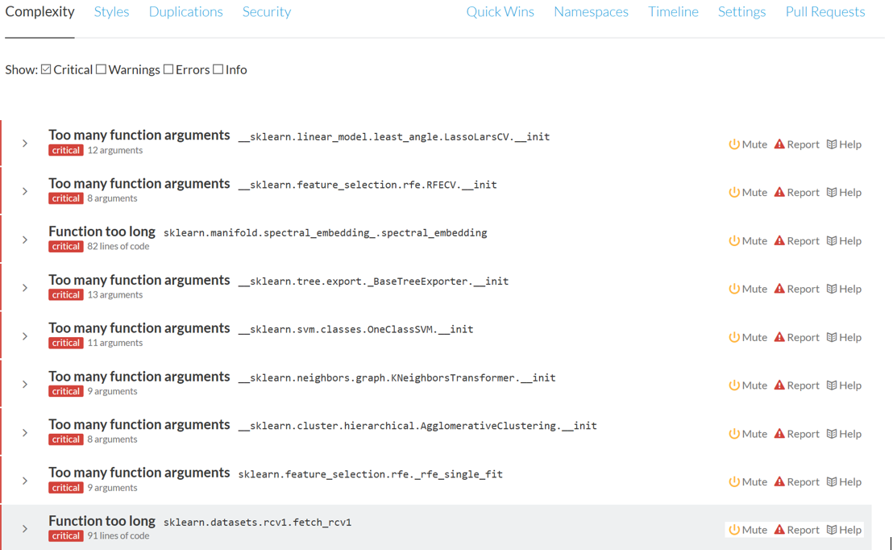

# Scikit-Learn - An open source framework for machine learning and data mining


<div align="center"></div>

<b>Proudly provided by Hu Longchen , Zheng Bowen, Xiao Jingyu, Huang Yukun.Group 12,WHU</b>

## Table of Contents
- [Scikit-learn  Software Architecture Report](#scikit-learn--software-architecture-report)
  * [Abstract](#abstract)
    + [Demo](#demo)
  * [1.Introduction](#1introduction)
  * [2.Stakeholders](#2stakeholders)
    + [2.1 Stakeholders Analysis](#21-stakeholders-analysis)
      - [Core Team Members & Contributors](#core-team-members---contributors)
      - [Additional Stakeholders](#additional-stakeholders)
    + [2.2 Power-interest grid](#22-power-interest-grid)
  * [3. System Quality Attribute Analysis](#3-system-quality-attribute-analysis)
  * [4. Context View](#4-context-view)
    + [4.1 Design Philosophy](#41-design-philosophy)
    + [4.2 Environment Analysis](#42-environment-analysis)
  * [5. Development View](#5-development-view)
    + [5.1 Codeline Organization](#51-codeline-organization)
    + [5.2 Module Structure Model](#52-module-structure-model)
  * [6. Deployment View](#6-deployment-view)
    + [6.1 Dependencies](#61-dependencies)
    + [6.2 Environment/Runtime Environment](#62-environment-runtime-environment)
    + [6.3  Specialist Knowledge](#63--specialist-knowledge)
  * [7. Process View](#7-process-view)
  * [8. Functional View](#8-functional-view)
    + [8.1 Scikit-learn API](#81-scikit-learn-api)
    + [8.2 Functional Relationship](#82-functional-relationship)
    + [8.3 Functional Flow](#83-functional-flow)
  * [9. Pattern and Tactics](#9-pattern-and-tactics)
    + [9.1 Pipe filter pattern](#91-Pipe-filter-pattern)
      - [9.1.1 Usability](#911-usability)
      - [9.1.2 Extensibility](#912-extensibility)
    + [9.2 Tactics](#92-tactics)
      - [9.2.1 Usability](#921-usability)
      - [9.2.2 Extensibility](#922-extensibility)
      - [9.2.3 Performance](#923-performance)
        * [Control Resource Demand](#control-resource-demand)
          + [Linear Algebra Library:](#linear-algebra-library-)
          + [Limit Working Memory:](#limit-working-memory-)
        * [Manage Resources](#manage-resources)
          + [Model Compression:](#model-compression-)
          + [Model Reshaping](#model-reshaping)
  * [10. Design Principle And Method](#10-design-principle-and-method)
    + [10.1 Single responsibility principle](#101-single-responsibility-principle)
    + [10.2 Open Closed Principle](#102-open-closed-principle)
    + [10.3 Liskov Substitution Principle](#103-liskov-substitution-principle)
    + [10.4 Dependence Inversion Principle](#104-dependence-inversion-principle)
    + [10.5 Interface Segregation Principle](#105-interface-segregation-principle)
    + [10.6 Consistence Principle](#106-consistence-principle)
    + [10.7 Mixin Class Design Method](#107-mixin-class-design-method)
  * [11. Computation Performance Perspective](#11-computation-performance-perspective)
    + [11.1 Prediction latency](#111-prediction-latency)
      - [11.1.1 Influence of the Number of Features](#1111-influence-of-the-number-of-features)
      - [11.1.2 Influence of the Input Data Representation](#1112-influence-of-the-input-data-representation)
      - [11.1.3 Influence of the Model Complexity](#1113-influence-of-the-model-complexity)
      - [11.1.4 Feature Extraction Latency](#1114-feature-extraction-latency)
    + [11.2 Prediction Throughout](#112-prediction-throughout)
  * [12. Technical Debt](#12-technical-debt)
    + [12.1 Static Code Debt](#121-static-code-debt)
      - [12.1.1 Results](#1211-results)
      - [12.1.2 How Code Debt Influence Quality Attribute](#1212-how-code-debt-influence-quality-attribute)
    + [12.2 Testing Debt](#122-testing-debt)
      - [12.2.1 Unit testing](#1221-unit-testing)
      - [12.2.2 Integration Testing](#1222-integration-testing)
  * [13. Evolution Perspective](#13-evolution-perspective)
  * [14. Conclusion](#14-conclusion)
  * [15. References](#15-references)


## Abstract

Scikit-learn was started in 2007 as a Google Summer of Code project by David Cournapeau. It is a tool for machine learning in the Python language. Due to its simplicity and efficiency, it has been one of the most used libraries in machine learning. As an open-source project, there are many developers contributing and keeping it growing. So, we decide to do a stakeholder analysis to figure out the aspect of its development members. Then, we describe scikit-learn from various viewpoints to show off its software architecture. In order to understand the project comprehensively, we do analysis of technical and testing debt in the end of chapter.

### Demo

```python
import numpy as np
import pandas as pd
import matplotlib.pyplot as plt
import sklearn
from sklearn.datasets import load_boston
boston = load_boston()

from sklearn.linear_model import LinearRegression

bos = pd.DataFrame(boston.data)
bos.columns = boston.feature_names
bos['PRICE'] = boston.target
bos.head()

X = bos.drop('PRICE', axis=1)
lm = LinearRegression()
lm.fit(X, bos.PRICE)

print('线性回归算法w值：', lm.coef_)
print('线性回归算法b值: ', lm.intercept_)

import matplotlib.font_manager as fm
myfont = fm.FontProperties(fname='C:/Windows/Fonts/msyh.ttc')
plt.scatter(bos.RM, bos.PRICE)
plt.xlabel(u'住宅平均房间数', fontproperties=myfont)
plt.ylabel(u'房屋价格', fontproperties=myfont)
plt.title(u'RM与PRICE的关系', fontproperties=myfont)
plt.show()
```

 <div align=center> <br>
 
 Figure 0.1 </div>

 <div align=center><br>
 
 Figure 0.2 </div>
 
 
## 1.Introduction


Scikit-learn is a classical algorithm frame, which begins from Google Summer of Code in 2007. It’s a simple and efficient library and supplies many algorithms for unsupervised training and supervised training to
finish data mining and analysis. Its algorithm almost includes all fields of machine learning, which indicates the importance of the project. The algorithm library is based on Scipy so that you must download Scipy before using scikit-learn. Besides, the frame also has Numpy, matlibplot, IPython, Sympy and Pandas as dependence. Comparing to another famous algorithm frame, tensorflow, scikit-learn pays more attention to the module of algorithms. It’s convenient to use functions or modules in scikit-learn.The basic functions of Scikit-learning are divided into six parts: classification, regression, clustering, data dimensionality reduction, model selection and data preprocessing.


## 2.Stakeholders

### 2.1 Stakeholders Analysis

#### Core Team Members & Contributors

In this section, According to Wikipedia,Stakeholder means an group,corporate,organization,member,or system that affects or can be affected by an organization’s actions. We explain it referred to Rozanski           and Woods' book and classified it into those categories:

|Stakeholders|Description|Quality Attribute Stakeholder Concern|
| ---- | ---- | ---- |
| Acquirers|Acquirers are always connected with acquisition that is an economic activity through which a company acquires a degree of control over another company in order to achieve an economic goal. For scikit-learn,acquirers offer the needed funding for the development of the system and maybe need to make a decision about purchasing the it and profit from it .Some of the examples are Columbia University,Google and INRIA. | Acquirers need the system run normally as long as possible,the main quality attributes they concern are performance,usability,reliability,continuous availability and robustness. |
| Assessors| Assessors evaluate and demonstrate the plan to decide whether to adopt or not. For scikit-learn,assessors evaluate whether the operation of the system meets the requirements and conforms to the law,and whether it is beneficial to the development of the system when there are some advice about the system. All in all,they need to decide if those advice are meant to applied. Examples in this system : Decisions about the future of the project are made through discussion with all members of the community. All non-sensitive project management discussion takes place on the project contributors’ [mailing list](mailto:scikit-learn@python.org) and the [issue tracker](https://github.com/scikit-learn/scikit-learn/issues). Occasionally, sensitive discussion occurs on a private list. | Assessors need to evaluate the possible decisions like new functions of the system,so they may concern more about the modifiability and scalability in all those quality attributes. |
| Communicators| Communicators are responsible for talking with others including explaining, teaching, negotiating, responding. Everything associated with outward words are about communicators. For scikit-learn,communicators are responsible for explaining the functions of the system to others and helping others install and operate the system. In the same time,they need to write and use documentation, official documentation, API documentation, etc. Examples in this system: members of the community, users like college students of the system who will introduce the system to their friends and connected companies. | Communicators need to understand and explain the system,so they pay more attention on understandability,usability and continuous availability. |
| Developers| Developers are the main group for the specific software development,they are responsible for the whole procedure of the system from idea,designing,developing and modifying. For scikit-learn,The developers need to identify every detail of the software and develop the complete system from a vague concept. Also they need to confirm the system that it can operate normally after all the developing things. Examples in the system: Thomas J Fan,Alexandre Gramfort,Olivier Grisel.etc. | Developers are the main part of the system,they need to be concern with many attributes like understandability,reusability,portability,interoperability and safety. |
| Maintainers| Maintainers’ main job is about software modifications that are made after the release of a product to improve performance or other attributes due to bug fixes. For scikit-learn,Maintainers are aimed at the daily maintenance of scikit-learn to ensure the normal operation of software and emergency backup recovery and other measures like system maintenance, regular inspection, whether the software is normal operation, regular backup, clean up garbage information and so on,or maybe sometimes algorithm need to improved,which is also the job of maintainers. Examples in the system: the job is mainly performed by Andreas Müller,with some others who are willing to maintain the documentation and code of the library in GitHub. | As the logistical support of the system,maintainers need to pay attention to maintainability and scalability. |
| Production engineers | The main task of the production engineer is to make the process smooth and smooth, ensure that every gear in the production process is closely connected, so that the product can be launched according to the schedule, and even shorten the time from design to mass production, so as to win more market. For scikit-learn,production engineers generally belong to the category of technology department who are responsible for product technical support of the system. In some way,they need to adjust the environment of the hardware and software to ensure the normal running. Examples in the system: Andreas Müller as a release manager,is to do the mainly manage work. Also some staff in the companies who use scikit-learn and some volunteers in the GitHub help a lot.|Production engineers need to consider the environment and interaction of the system,so they are concerned about safety and interoperability.|
| Suppliers|Suppliers are those people or company who offer the sufficient support to a project. For scikit-learn,suppliers offer hardware and software to the development of the system. Some of them offer people and platform,some offer technology to help build environment,others offer software to test the algorithm,etc. Examples in the system: Rackspace provide with a free [Rackspace Cloud](https://www.rackspace.com/cloud/) account to automatically build the documentation with the example gallery;[Shining Panda](http://shiningpanda.com/) provide free CPU time on their Continuous Integration server.|Suppliers offer the necessary device supply of the system who need to know the system very well,so they pay more attention to the interoperability and portability.|
| System administrator |The system administrator is mainly responsible for the design, installation, configuration management and maintenance of the network equipment and server system of the entire network. Also,they are responsible for the daily management and maintenance of the specific information system, with the highest management authority of the information system. For scikit-learn,system administrator need to help users to run this python software at the very system they want. Examples in the system: Adrin Jalali,Guillaume Lemaitre are the main administrator of the system. |System Administrator are with the multi-platform of the system,so they are concerned about the portability,usability and understandability.|
| Testers|Testers are responsible for the process of operating a program under specified conditions to detect program errors, measure software quality, and evaluate whether it meets design requirements. For scikit-learn,testers are not only means some people who test databases and algorithm or other conventional functions,but also some devices or programs that can help test without people. Examples in the system: continuous integration tools like Jenkins will help people in community to test all the needs.|Testers need to have a periodic tests about the system,so the most important quality attribute for them is testability,in addition to this,they also concern about the scalability and reusability etc.|
| Users|Users,are persons who uses a computer or Internet service,also companies or some scientific group may also be the users,which is a broad concept. For scikit-learn,users are those who operate system by them selves or may take advantage of the system to help analyze the date. Due to scikit-learn is a system of  python,the users of it are from the every aspect about the Internet. Examples in the system: Individual users in computer programming;college students who are in the scientific group;college management in Wuhan university.|Users are the people or group who operate the system,so the usage experience is the most important part for them. On this basis, they pay more attention about the performance and usage above all quality attributes.|


#### Additional Stakeholders

Except for the main stakeholders of the method proposed by Rozanski & Woods,there are lots other stakeholders which are also really important. Here are those categories:

|Stakeholders|Description|Quality Attribute|
| ---- | ---- | ---- |
|Contributors      |Contributors are those who support the specific project with their money,physical power,wisdom or anything else.For scikit-learn,contributors are the largest group,some of whom support it with money,some of whom join the GitHub to manage the code and write the document,others help maintain the code or even in the class of the development.Examples in the system: Volunteers in the GitHub who join the code and have a raising; Big company like INRIA have a funding to the system,etc.|For different kinds of contributors have different concerns about those quality attributes,here are the conditions. For money-basis contributors,they are like acquirers who are more concerned about performance,usability,reliability,continuous availability and robustness. But for contributors who support with codes,they may pay attention to understandability, reusability, portability, interoperability and safety.      |
|Funders      |Funders are those who give a supporting to the development of the project,the supporting maybe material or spiritual.For scikit-learn,funders always offer the sufficient money support to help the development of the system,or the right of use of some device to help test or running. In return,they can get the right to use the product ahead of schedule or some percentage profit of the money gained by the product or some other benefit.Examples in the system:[INRIA](https://www.inria.fr/) actively supports this project;[Columbia University](https://columbia.edu/) funds Andreas Müller since 2016;[The University of Sydney](https://sydney.edu.au/) funds Joel Nothman since July 2017,etc.      | Funders are those who wish their funds have corresponding return,so they pay attention about performance,usability,reliability and robustness.     |
|Competitors      |Competitors generally refer to other enterprises that provide similar products or services and serve similar target customers. For scikit-learn,competitors are other system who provided the similar machine learning algorithm libraries which can get to the same outcome with it. Examples in the system: GraphLab,which is a library in C++.|Competitors always wants to find the advantages and disadvantages of the system,so they are concerned about almost all quality attributes,but some of them may be more important like understandability,scalability,reusability,testability,portability and maintainability etc.       |

 
<div align="center">Figure 2.1 Stakeholders</div>

<div align="center"><br>
<center>Figure 2.2 The connect between sklearn and stakeholder</center></div>

### 2.2 Power-interest grid


Figure 2.4 shows the quadrants of power and interest of scikit-learn stakeholders. The x-axis determines interest of stakeholders to scikit-learn which is divided into low and high interest. The interest of stakeholders is demonstrated by the profit which they can get from the project. The y-axis determines the power of stakeholders which is also divide into low and high power. Power is related to how influential the stakeholder is in scikit-learn's past, current, and future development.


In Figure 2.3, we divide the stakeholders into fours parts.

Core Developers: we think they should be “Manage Closely”, because the project is almost developed by them. They have rights and responsibility and may get profits from it. So, the interest and power of them must be high

Acquirers: They make decisions, offer the needed funding and profit from the project. The interest and power of them are also high.

Users: Comparing to other roles, user may have low power for the project. Because they are a broad concept. But as users, they are willing to use the project, so the interest of them must be high.

Suppliers: They offer the sufficient support for the project. But the suppliers are not a positive role which means the support may be not launched by them. So I think the power of them should be high and interest of them should be low.

Contributor: They support money, some of whom manage the code and write the document. I also think they have high power, and high interest.

Funders: They can get right to use the product and profit of money gained but the product. So, they have high power and interest.

Competitors: we think the competitors have low power because they can’t decide for the project directly. However, the interest may have high interest because the similar project may give them some idea and they are willing to use and explore the scikit-learn.


Github: GitHub is stakeholder that have no control over the management of Scikit-learn, nor do they directly benefit from it.


The following figure shows the power versus interest relation of the stakeholders of the Scikit-Learn:

<div align="center"><br>
<center>Figure 2.3  Power interest grid of Scikit-Learn</center></div>


The following figure shows the how we treat the stakeholders in difference quadrants:

<div align="center"><br>
<center>Figure 2.4  Power interest grid</center></div>


## 3. System Quality Attribute Analysis


• Availability • Efficiency • Flexibility • Integrity • Interoperability  • Scalability • Reliability  
• Robustness • Usability • Maintainability • Portability  • Reusability • Testability


<div align="center">table 3.2 Quality attributes of concern to stakeholders</div>


|Stakeholders|Quality Attribute Concern|
| :- | :- |
| Acquirers| Performance,Usability,Reliability,Continuous Availability,Robustness.|
| Assessors| Modifiability,Scalability|
| Communicators| Understandability,Usability,Availability.|
| Developers| Understandability,Reusability,Portability,Interoperability,Safety,Scalability.|
| Maintainers| Maintainability,Scalability.|
| Production engineers |Safety,Interoperability.|
| Suppliers|Portability,Usability Understandability.|
| Testers|Scalability,Reusability |
| Users|Performance,Usability|
| Contributors|Understandability,Reusability, Portability, Interoperability and Safety.|
| Funders|Performance,Usability,Reliability and Robustness.|
| Competitors|Understandability,Scalability,Reusability,Testability,Portability and Maintainability|


Sometimes, it is inevitable to make a trade-off between certain attributes. Users and developers must determine which attributes are more important than others and prioritize them. When they make decisions, they should always follow those priorities. Figures describe some typical relationships between quality attributes：

**Red indicates that the attributes of the row in which the cell is located increase the negative impact on the attributes of the column in which it is located.**

**Green indicates that the attributes of the row in which the cell is located increase the positive impact on the attributes of the column in which it is located.**


<div align="center">Figure 3.1 Some typical relationships between quality attributes</div>

**In the power interest grid, we divide stakeholders into four parts**
**The stakeholders in the upper right corner are the most important: core developers, suppliers, contributors, investors.**
**Therefore, we believe that the quality attributes concerned by these stakeholders are the most important.
**At the same time, the user in the lower right corner has a large audience. It includes various companies including machine learning** **business, as well as machine learning developers.**
**So we think the quality attributes that users are concerned about are equally important.**
**Among many quality attributes, portability, interoperability and integrity need not be concerned, because Python itself is a cross** **platform programming language, and sklearn, as a framework for machine learning developers, does not have the problem of human-computer interaction(which means interoperability doesn't need to be considered). It does not store users or other relevant data.(which means Security and reliability doesn't need to be considered)**


The following is an analysis of the importance of quality attributes:

<div align="center">table 3.2 The importance of System quality attribute</div>

| Quality Attribute | Description                                                  | Importance Degree |
| ----------------- | ------------------------------------------------------------ | ----------------- |
| Usability         | I think usability is the most important attribute for  users. Sklearn provides a series of APIs for developers (i.e. users). Whether   developers will use sklearn framework depends on whether they can quickly get   familiar with calling a series of APIs of sklearn to complete machine   learning tasks. | ⭐⭐⭐⭐⭐             |
| efficiency        | Efficiency, I think, is as important as availability.   Users expect sklearns to produce clustering, regression, and decision-making   results soon. | ⭐⭐⭐⭐⭐             |
| Scalability        | Because machine learning algorithms are constantly developing, new algorithms will appear, so the scalability of sklearn must be enhanced by adding new functions | ⭐⭐⭐⭐⭐             |
| maintainability   | Maintainability indicates how easy it is to correct a   defect or make a change in software. Because sklearn is a big framework, some   mistakes may lead to catastrophic consequences, and also many people   contribute to the project. So I think maintainability is the important quality attribute. | ⭐⭐⭐⭐⭐             |
| Understandability       | Understandability Intelligibility is important for developers, maintainers, testers, contributors, and users | ⭐⭐⭐⭐             |
| reusability       | In terms of the long-term goal of software development,   reusability indicates the extent to which a software component can be used in   other applications in addition to the original system. Because different   algorithms in machine learning may use the same basic computation. For   example, the maximum and minimum clustering and K-means clustering in   clustering will use Markov distance and Euclidean distance to calculate.   Reuse this part of the code to make the system redundant | ⭐⭐⭐⭐               |
| flexibility       | Flexibility is important because as research progresses,   there will be many new machine learning algorithms and models. Sklearns need   to keep up with the pace of iteration to meet user needs. | ⭐⭐⭐⭐              |
| testability       | Because all three of the above quality attributes can   promote testability, the focus on testability is less important. | ⭐⭐⭐               |
| reliability       | Reliability is necessary to ensure the correctness of  machine learning algorithm | ⭐⭐⭐               |
| Availability      | Sklearns can be invoked by developers at any time.   Effectiveness is less important. | ⭐⭐                |
| Integrity         | Sklearns do not involve user-related information   operations and do not need to care too much about reliability. | ⭐⭐                |
| robustness        | The premise of using sklearn is that the relevant   operators are already familiar with the API calls, the familiar people can   ensure the correctness of the parameters passed, and the incorrect compiler   will prompt related errors in time, so robustness is not so important. | ⭐⭐                |
| portability       | Portability is not a concern of developers. Python   language has good portability (Python can run across operating platforms,   that is, the core language and standard library of Python program can run on   Linux, Windows and other platforms with Python interpreter without any   difference). ) It ensures that sklearn has good portability. | ⭐⭐              |
| interoperability  | Because sklearn users are specialists in machine learning   and development, and do not involve GUI and human-computer interaction,   interoperability is less important. | ⭐⭐                |

**Conclusion:According to the analysis in the above table, in the process of recovering the sklearn architecture, ease of use, performance and scalability are the quality attributes we focus on.**


## 4. Context View

This section contains the relationship between scikit-learn and other related entities. First we will give the design philosophy of it and then, we can understand the relationship between scikit-learn and environment
better.

### 4.1 Design Philosophy

1. Consistence: All interfaces are consistence and simple. The interfaces can be divided as three classes as below:

a)       Estimator: Any objects which can give an estimate for data can be regarded as an estimator. It 

b)       Transformer: Some estimators which are used to transfer data set can be regarded as transformer. It accepts a data set and returns a data set.

c)       Predictor: Some estimators can give prediction for a data set which are called predictor.

2. Checkable: All super-parameters and parameters in learning of estimators can be access by public attributes of instance.

3. Strict class definition: the class of data set is from numpy or scipy. The scikit-learn doesn’t support specific data type which promises the stable of model.

4. Reuse: Try to use existing models to finish task. For example, users can use some any transformers and a predictor to form a pipeline.

 

We can learn that the main target of scikit-learn is to make user understand the project better. The consistence of it make sure that there is a common concept for users. The checkable parameters can help users figure out the details of machine learning and strict class definition reduce the complexity of the project. Last, the reuse models make the development simple and various.


### 4.2 Environment Analysis

Figure 4.1 show that the relationship between scikit-learn and its environment. There are seven related entities which stand for two types. One type is connection between scikit-learn and some organizations, like WHU or NYU. Another type is from software aspect. For example, software dependency or version control tools, like numpy or GitHub. The length of lines between them and scikit-learn represents the closeness of connection. For instance, user, developer and software dependency should be closest to scikit-learn. To contrary, competitor may have less connection with it.


<div align="center">Figure 4.1 Environment relationship of scikit-learn</div>


Figure 4.1 show that the relationship between scikit-learn and its environment. 
With this figure, we can clearly see external entities of scikit-learn.
scikit-learn is...  
- programmed in: Python
- developed by: core developers & community developers
- versioning&issue tracking: Git, GitHub, npm
- running on: Windows, OS X, Linux（cross-platform）
- dependencies: Numpy, Scipy, Matplotlib
- communicated via: StackOverflow
- licensed by：BSD 3-Clause
- used by：students of Wuhan university and other universities, Inria ...
- competed against：Dlib, Mcap...
- funded by: Inria, NYU, Paris-Saclay Center for Data Science, Télécom Paristech...


## 5. Development View

This section gives an overview of the structure of the Scikit-learn project from the perspective of the developers. The development view is what gives developers (and testers) a bird eye view of the architecture. It should not be too detailed or descriptive, but still cover the most important bases. The development viewpoint discussed here is about scikit-learn's module structure model and codeline organization.


### 5.1 Codeline Organization

The scikit-learn source files are organized based on their functionalities. 

The main machine learning algorithms are encapsulated in the *sklearn* folder.  Each sub-folder of sklearn (such as cluster) contains an algorithm, which includes the algorithm's .py file, .pyx file (a Cython file), and a test folder. In the test folder are the test algorithm’s .py files.  

In the *examples* folder, there are demos and running results for various algorithms for users to preview. Each subfolder includes .py files and a documentation.  

The *doc* folders contains various materials, images, data, update information and developer lists referenced by sklearn. Most data files are saved in .rst files. 

 In the *benchmarks* folder, all of the .py files are for computing presets and benchmarks.

 In the *build_tools* folder, it contains the shell scripts in the Linux environment of different build tools(circle, travis and azure). 


<div align="center">Figure 5.1 The file distribution tree</div>


### 5.2 Module Structure Model

The module structure model defines the organization of the system's source code and related external systems, in terms of the modules into which the individual source files are collected and the dependencies among these modules. In Figure layers are identified for scikit-learn With each layer consisting of one or more module(s). These layers are:

Domain layer: This layer corresponds to the sklearn folder and the various algorithms encapsulated in it.

Utility layer: Consisting of modules that support basic functionality that can be used in domain layer.

Platform layer: It contains modules for required packages, such as python, NumPy, SciPy and MatPlotLib.

Build tool layer, which contains build modules to build the library. Each module consists of files to download, install, testing, or setting the required library. 

Dependency of one layer to the other layer(s) is proven by an arrow which points to the destination of the required layer. As an example, the utility layer uses all libraries available from python, NumPy, SciPy, and MatPlotLib by importing them in the module. In addition, there are explicit intermodule dependencies for all modules in the domain layer for python because all files under each module requires python. 




<div align="center">Figure 5.2 The Module Structure</div>


## 6. Deployment View

The deployment view is used to show the physical architecture of the software and hardware in the system. From the deployment view, we can see the physical relationship between software and hardware components and the component distribution of the processing nodes. Deployment view shows the structure of the runtime system, as well as convey the configuration and deployment of the hardware and software elements that make up the application.For scikit-learn,we will take three aspects:its dependencies,environment/runtime environment and required specialist knowledge to analyse its deployment view.


### 6.1 Dependencies

Users need some basic environment and program support to install and use scikit-learn normally,which related to the development language, environment, and process of the system itself.It includes:

A.  Basic installation requirements

·Python(>=3.5),Users of scikit-learn will need support from the new version of python.

·NumPy(>=1.11.0),The higher version of NumPy provides python with an efficient extension of numerical computation to store and process large matrices.

·SciPy(>=0.17.0),It is used to effectively compute NumPy matrix, enabling NumPy and SciPy to work together and solve problems efficiently.

·joblib(>=0.11),It provides an easy way to serialize objects that contain large data arrays and can also be used to store data models.

B.  Scikit-learn drawing function (the function starts with "plot_" )requires Matplotlib(>= 1.5.1). Some scikit-learn examples may require one or more additional dependencies :scikit-image(>= 0.12.3), panda(>= 0.18.0)

C.   Users can use **conda** or **pip** to include the scikit-learn and NumPy,SciPy(Installed on PyPy, it will need pypy3-v5.10 +, Numpy 1.14.0+, and scipy 1.1.0+)

D.  User can also use [**Canopy**](https://www.enthought.com/products/canopy) and [**Anaconda**](https://www.continuum.io/downloads) to Enrich some useful scikit-learn libraries

E.   WinPython is a useful component that provides simplified operations and smoother computing for Windows operating systems.


### 6.2 Environment/Runtime Environment

Runtime Environment,is also called run-time system.which is an environment in which a semi-compiled runtime code is run on a target machine.The runtime environment contains the necessary support to enable the system to run, enabling users to achieve their goals through a series of operations using the system.In scikit-learn,users can conduct machine learning related seminars and studies, and can conduct normal data mining and data communication.For scikit-learn runs with python,the environment of it is not that complex and can be defined by its transplanted host machine.It may include:

A.  All the dependencies above.For the dependencies are the basic support for the system to run,without which scikit-learn is just a shell.

B.  A specific device/machine with the python support,the machine can be a host or pc or mobile phone,pad etc.It needs to have a processor or mini processor to have ability to do some calculation(with necessary storage and RAM and ROM or a little flash memory )

C.   Some operating system may have different effect to the system.For example.windows may be the best system for scikit-learn,for it also offer some additional component and tool package for user to do it more easily.Mac OS or Linux are also applicable,its component may be added in the next edition.

Except all those environments above,the actual running environment is relevant to the different machines of each user.Perhaps the environment variable configuration of other software will affect the use of scikit-learn,or some version of the environment may conflict with the computer system,or errors may occur due to configuration differences during use.So users in the above environment should also be based on the actual machine fine-tuning operation.


### 6.3  Specialist Knowledge

For scikit-learn is a professional system with high level machine learning knowledge.It is positioned as a simple and efficient tool for data mining and data analysis.So users who want to use it for some personal or academic or commercial use,he must have the necessary knowledge.People who have the knowledge will be the dominant person in the academic work in a group or the popular one who may be more likely appointed the head of the company in a specific scikit-learn project.Here are some sufficient knowledge.

A.  Machine learning.Machine learning studies how computers simulate or implement human learning behavior in order to acquire new knowledge or skills and reorganize the existing knowledge structure so as to continuously improve its own performance.For scikit-learn is exactly the tool with high level machine learning which includes Supervised learning,classification,regression,Unsupervised learning etc.Knowing knowledge like neural network techniques,  k-means will help a lot.

B.  Higher mathematics,which is the basic math theory for all those calculations.Being good at this will shorten the design of the algorithm.

C.   Linear algebra.scikit-learn project have a lot with matrix calculation,it can be calculated with the python package but also need to be designed with some basic knowledge.Except this,linear space and linear return etc. are also useful and are the basic theory of other subject.

D.  Probability theory.When users need to calculate some probability issues while he is doing data mining,this subject is really useful.With some theoretical basis of integration,user will feel easy to do things.

E.   Algorithm basic.Sometimes users will want to see the data sets or algorithm in the scikit-learn to help understand the principle of the system.Or he can write some algorithm to help academy data mining work.In this time,a good programmer with super algorithm ability will like a duck to water.


<div align="center">Figure 6.1 The deployment view for scikit-learn</div>


## 7. Process View

For a machine learning architecture, it is very important to understand its use process. The following process view shows how to use sklearn for machine learning.

 <div align=center> <br>
 
 Figure 7.1 Process view </div>
 
- Step1 The first is data acquisition. You can use your own data set or the data set that comes with sklearn's data set.
- Step2 The second step is to preprocess the data. It needs to use the transformer in sklearn to normalize the data, reduce the dimension, extract the feature, partition the training set and test set.
- Step3 The third step is to select the appropriate classifier according to the specific problems, and use the prepared data for training.
- Step4 The fourth step is to evaluate the model, using the API provided by the estimator in sklearn. View the model score : score (x_test, y_test) View the rating report of the classification model: classification_report() Score with cross validation: cross_val_score
- Step5 Optimize the model
- Step6 Using the pickle module of Python to persist the model


## 8. Functional View

### 8.1 Scikit-learn API

As we all know,Sk-Learn is made up of many packages,which all have different functions and focused effects.The details of these packages are available in the API documentation.We use XMind to simplify the API and make a mind map of it.

SK-Learn API is made of 4 parts.NN algorithm, mathematical algorithm, basic common, method process.

·NN algorithm:It is the core algorithm of the whole deep learning, which is an extension of the neural network algorithm. It is the progression from single-layer neural network to multi-layer neural network, which is the algorithm basis of sk-learn.

·Mathematical Algorithm:All mathematical algorithms or formulas used by sk-learn are collected and incorporated into packages for easy use and reference.Such as the common regression algorithm, bayesian formula and so on.In addition, certain data structures and algorithms are defined in this package, such as trees and SVM, etc., which are often used in the process of machine learning.

·Basic Common:This section defines some patterns and technologies commonly used by sk-learn, such as pipeline technology, which is a basic technology for information transmission. As well as defining the underlying data sets and exception packages, and so on, will play an important role in the use.

·Method Process：This section contains the top effects and technologies of sk-learn. For example, matrix is an important and commonly used part, with the support of the underlying algorithm and formula. When using matrix package, users can easily use the regression and recursive work supported in the upper package. Some other auxiliary functions such as pretreatment and multi-output can also package the function of the system more completely.

<div align=center> <br>
 
Figure 8.1 sk-learn API </div>
 
 
### 8.2 Functional Relationship

Sk-Learn can be roughly divided into six functional areas : classification, clustering,regression ,dimensionality reduction,data preprocessing and model selection.

·Classification&Regression:

Both classification and regression are intended to establish a prediction model H. Given an input x, an output y can be obtained:Y = H (x).The only difference is that in the classification problem, y is discrete; And in the regression problem y is continuous. So in general, the learning algorithm for both problems is very similar. So on this graph, we see that the learning algorithm used in the classification problem can also be used in the regression problem. The most commonly used learning algorithms for classification problems include SVM (support vector machine), SGD (random gradient descent algorithm), Bayes (bayesian estimation), Ensemble, KNN, etc. The regression problem can also use SVR, SGD, Ensemble and other linear regression algorithms.


·Clustering:

Clustering is also the attribute of the analysis sample, which is similar to classification, except that classification knows the range of y before prediction, or knows how many categories there are, while clustering does not know the range of attributes. Therefore, classification is often called supervised learning and clustering is called unsupervised learning.
Clustering does not know the attribute range of the sample in advance, so it can only analyze the attribute of the sample based on the distribution of the sample in the feature space. The problem is usually more complicated. The commonly used algorithms include k-means (k-mean), GMM (gaussian mixture model), etc.


·Dimension reduction:

Dimension reduction is another important area of machine learning, dimension reduction has many important applications, the characteristics of high dimension, will increase the burden of training and storage space, dimension reduction is to remove redundant features, with more dimension to represent the characteristics of less. The most basic is the PCA dimensionality reduction algorithm, behind a lot of algorithms are based on PCA evolved.

·Data preprocessing:

Data preprocessing is an auxiliary module, which can normalize the data and so on.

·Model selection:

Model selection module provides model optimization method and model score view method.

<div align=center> <br>
 
Figure 8.2 sk-learn Functional Area Relationship </div>


### 8.3 Functional Flow

The following figure describes the functions sklearn provides to users. As well as the process that users can use sklearn for machine learning according to their own needs and data volume.

<div align=center> <br>
 
Figure 8.3 sk-Learn functional flow chart </div>


## 9. Pattern and Tactics  

In this chapter, we focus on the important quality attributes of sklearn: performance, usability, scalability. We analyze the pattern and tactics of sklearn architecture.

### 9.1 Pipe-filter pattern

To reach usability and scalability, scikit-learn uses the **“Pipe-filter pattern”.**  The process of the pattern can be explained as below:

In the architecture mode of pipeline and filter, each component has a set of input, output, and component reads the input data stream. After internal processing, the output data stream is generated. This process mainly completes the transformation and incremental calculation of input stream. In general, the components here are called filters, and the connectors are like pipes for data flow transmission, which transfer the output of one filter to the input of another. The correctness of the filter output does not depend on the order in which the filter performs incremental calculations.

In scikit-learn, estimators can be regarded as the component in the data stream. Some estimators work as input-filter which implement fit and transform methods to finish the task. And the other estimators work as produce-filters which have responsibility to execute the data from input-filter and make the corresponding predict, cluster or others machine learning operation. Also, there are some estimators call “final estimator” which work as output-filter. They are the last step of the process which give the result of this process. The graph gives more details of the process.


<div align=center> <br>
 
Figure 9.1 Filter pattern</div>


The advantage of the pipe-filter pattern provide the project usability and extensibility.

**Usability**: Any two filters can be connected as long as the data transmitted between them complies with the common protocol. Each filter has its own independent input and output interface. If the data transmitted between filters comply with its specifications, they can work normally as long as they are connected by pipes. So users only need to know the protocol then they can use the project.

**Scalability**: The old filter can be replaced, and the new filter can be added to the existing system. Easy maintenance and upgrade of software is one of the important indicators to measure the quality of software system. In the pipeline filter model, as long as the input and output data specifications are observed, any filter can be replaced by another new filter. At the same time, new filters can be added to enhance program functions. In this way, the maintainability and upgradeability of the system are guaranteed. 


### 9.2 Tactics

#### 9.2.1 Usability

(1)	Runtime tactics: This tactic is to let users understand what the system is doing through various prompts when the system is running. In scikit-learn, the project uses the function’s name to make users understand the purpose of function or component.

(2)	Design time tactics: The tactic is to make project understandable in design period. The scikit-learn uses pipe-filter pattern which promises the common protocols for users. It’s easy for users to use the components.

#### 9.2.2 Extensibility

(1)	Local Modify: The tactic is to maintain semantic consistency and generalize modules. Maintaining semantic consistency means the different responsibilities in module are independent from each other. It’s true in scikit-learn project which satisfies the SOLID principles. Generalize modules means the modules are abstract super-class to define the modules. In scikit-learn, the estimators are from super mixin classes and the classes are from the base class. It’s easy for developers to control the change in local field.

(2)	Prevent chain reaction and delay binding time: The tactic promises that the modules to be changed should be minimized. In scikit-learn, the existed modules have common functions and interfaces from super classes so that there is less change for other classes when a class is changed. Meanwhile, the specific class is used less in the pipeline so that the binding time is delayed to the runtime which allows change in abstract level if there is a problem in process.

#### 9.2.3 Performance

The goal of performance tactics is to generate a response to an event arriving at the system within some time-based constraint. The event can be single or a stream and is the trigger to perform computation. Performance tactics control the time within which a response is generated.

We can either reduce demand for resources or make the resources we have handle the demand more effectively:
Control resource demand: This tactic operates on the demand side to produce smaller demand on the resources that will have to service the events.

Manage resources: This tactic operates on the response side to make the resources at hand work more effectively in handling the demands put to them.

##### Control Resource Demand

###### Linear Algebra Library:

Since scikit-learn relies heavily on Numpy/Scipy and linear algebra, you need to understand the versions of these libraries. Basically, you should make sure to build the Numpy library with optimized BLAS / LAPACK.

Not all models benefit from optimized BLAS and Lapack implementations. For example, models based on randomized decision trees typically do not rely on BLAS calls in the inner loop, kernel SVMs (SVC, SVR, NuSVC, NuSVR). On the other hand, linear models implemented using BLAS DGEMM calls (via numpy.dot) will generally benefit from the adjusted BLAS implementation and result in an order of magnitude acceleration of non-optimized BLAS.

The Optimized BLAS / LAPACK implementation includes:
- Atlas (requires hardware-specific tuning by rebuilding on the target machine)
- OpenBLAS
- MKL
- Apple Accelerate and vecLib frameworks (OSX only)


###### Limit Working Memory:

A large amount of temporary memory is required when implementing some calculations using standard numpy vectorization operations. This can drain system memory. In places where we can perform calculations in fixed memory blocks, we try to do this and allow the user to use sklearn.set_config or config_context to indicate the maximum size of the working memory (default is 1GB).


##### Manage Resources

###### Model Compression:

Model compression in scikit-learn only focuses on linear models. In this case, this means we want to control the model sparsity (ie the number of non-zero coordinates in the model vector). It is a good idea to combine model sparsity with sparse input data representation.

For synthetic data, a typical benchmark reduces the latency by 30% for both model and input. Your mileage may vary depending on the sparseness and size of your data and models. Therefore, to reduce the memory usage of predictive models deployed on production servers, extensions can be very useful.

###### Model Reshaping

Model reshaping consists in selecting only a subset of the available features to fit the model. In other words, if the model is discards features during the learning phase, we can remove those features from the input. This has several advantages. First, it reduces the overhead of the model's own memory (and therefore the time). Once you know which features to keep from the last run, it also allows discard explicit feature selection components in the pipeline. Finally, it can help reduce the processing time and I/O usage of data access and feature extraction layers upstream by not collecting and building features that are discarded by the model. For example, if the raw data comes from a database, you can write simpler and faster queries or reduce the use of I/O by having the query return a lighter record. Currently, reshaping needs to be performed manually in scikit-learn. In the case of sparse input (especially CSR format), it is usually not possible to generate related features to make them empty.


## 10. Design Principle And Method

In this part, we read the source code of sklearn, and have a deep understanding of the design principles used by sklearn. And how these design principles will affect the quality attributes of the system.

#### 10.1 Single responsibility principle

The	Single Responsibility Principle states that a class should only have a single responsibility. From the structure of scikit-learn, we can find the project is divided into multiple part.


<div align=center> <br>
 
Figure 10.1 Sklearn File Schema </div>


Each part is responsible to its responsibility. For example, the cluster only does for cluster analysis, the k_means only does for k-means clustering algorithm. If there is a future feature need to be added, the developer just need to add another part or a file to it. It’s not necessary to change the original code.


#### 10.2 Open Closed Principle

The Open/Closed Principle states that software entities should be open for extension, but closed for modification.

In scikit-learn, all parts have common functions which are demanded in base.py. The file requires that the later class need to implement the base function. For example, the classifier need to implement function “score”. Then, the later class can be used as original one. It’s convenient for developers and users to extend the project and function. Because it doesn’t change any existed codes.

#### 10.3 Liskov Substitution Principle

The Liskov Substitution Principle states that if S is a subtype of T then objects of type T may be replaced with objects of type S.

That’s true in scikit-learn. Each sub-class will implement the functions that super-class requires. For example, the k-mean class implements function “fit_predict” which are from ClusterMixin. 

K-means:
```python
def fit_predict(self, X, y=None, sample_weight=None):
        """Compute cluster centers and predict cluster index for each sample.

        Convenience method; equivalent to calling fit(X) followed by
        predict(X).

        Parameters
        ----------
        X : {array-like, sparse matrix}, shape = [n_samples, n_features]
            New data to transform.

        y : Ignored
            not used, present here for API consistency by convention.

        sample_weight : array-like, shape (n_samples,), optional
            The weights for each observation in X. If None, all observations
            are assigned equal weight (default: None)

        Returns
        -------
        labels : array, shape [n_samples,]
            Index of the cluster each sample belongs to.
        """
        return self.fit(X, sample_weight=sample_weight).labels_
```

ClusterMixin:
```python
class ClusterMixin:
    """Mixin class for all cluster estimators in scikit-learn."""
    _estimator_type = "clusterer"

    def fit_predict(self, X, y=None):
        """Performs clustering on X and returns cluster labels.

        Parameters
        ----------
        X : ndarray, shape (n_samples, n_features)
            Input data.

        y : Ignored
            not used, present for API consistency by convention.

        Returns
        -------
        labels : ndarray, shape (n_samples,)
            cluster labels
        """
        # non-optimized default implementation; override when a better
        # method is possible for a given clustering algorithm
        self.fit(X)
        return self.labels_
```

#### 10.4 Dependence Inversion Principle

Dependency Inversion Principle states that high level modules should not depend on low level modules, but instead both should depend on abstractions. Furthermore, abstractions should not depend on details but details on abstractions.

The principle can be shown by pipeline.py. In the file, all work is based on the abstract functions. It’s a little different to traditional principle’s definition. Because in python, the multiple class inherit is implemented by mixin class which can be regarded as interface. There is an example:
```python
    @if_delegate_has_method(delegate='_final_estimator')
    def fit_predict(self, X, y=None, **fit_params):
        """Applies fit_predict of last step in pipeline after transforms.

        Applies fit_transforms of a pipeline to the data, followed by the
        fit_predict method of the final estimator in the pipeline. Valid
        only if the final estimator implements fit_predict.

        Parameters
        ----------
        X : iterable
            Training data. Must fulfill input requirements of first step of
            the pipeline.

        y : iterable, default=None
            Training targets. Must fulfill label requirements for all steps
            of the pipeline.

        **fit_params : dict of string -> object
            Parameters passed to the ``fit`` method of each step, where
            each parameter name is prefixed such that parameter ``p`` for step
            ``s`` has key ``s__p``.

        Returns
        -------
        y_pred : array-like
        """
        Xt, fit_params = self._fit(X, y, **fit_params)
        with _print_elapsed_time('Pipeline',
                                 self._log_message(len(self.steps) - 1)):
            y_pred = self.steps[-1][-1].fit_predict(Xt, y, **fit_params)
        return y_pred
```

It doesn’t require the class’s type. The only important thing there is method the class has. If it has, then pipeline does. So that the multiple inherit can be done.


#### 10.5 Interface Segregation Principle

The Interface Segregation Principle states that no client should be forced to depend on methods	it does not use.

This does happen on occasion inside scikit-learn for example multiclass creates a LabelBinarizer, meaning it	is now dependent on how LabelBinarizer works for its own behaviour. Instead of passing a LabelBinarizer through the constructor.
```python
    def fit(self, X, y):
        """Fit underlying estimators.

        Parameters
        ----------
        X : (sparse) array-like, shape = [n_samples, n_features]
            Data.

        y : (sparse) array-like, shape = [n_samples, ], [n_samples, n_classes]
            Multi-class targets. An indicator matrix turns on multilabel
            classification.

        Returns
        -------
        self
        """
        # A sparse LabelBinarizer, with sparse_output=True, has been shown to
        # outperform or match a dense label binarizer in all cases and has also
        # resulted in less or equal memory consumption in the fit_ovr function
        # overall.
        self.label_binarizer_ = LabelBinarizer(sparse_output=True)
        Y = self.label_binarizer_.fit_transform(y)
        Y = Y.tocsc()
        self.classes_ = self.label_binarizer_.classes_
        columns = (col.toarray().ravel() for col in Y.T)
        # In cases where individual estimators are very fast to train setting
        # n_jobs > 1 in can results in slower performance due to the overhead
        # of spawning threads.  See joblib issue #112.
        self.estimators_ = Parallel(n_jobs=self.n_jobs)(delayed(_fit_binary)(
            self.estimator, X, column, classes=[
                "not %s" % self.label_binarizer_.classes_[i],
                self.label_binarizer_.classes_[i]])
            for i, column in enumerate(columns))

        return self
```

### 10.6 Consistence Principle

Let's talk about the consistency of sklearn. In sklearn, there are three models that show consistency: Transforme, estimator and pipeline.

Transformer does data conversion, such as normalization and dimensionality reduction.


<div align=center> <br>
 
Figure 10.2 Transformer </div>


Estimators, all machine learning algorithm models, are called estimators, which output prediction results.


<div align=center> <br>
 
Figure 10.3 Estimator </div>

So what is a pipeline? Let's take a simple example: when we need to do linear classification,
Each column of the dataset is standardized before it can be applied to the linear classifier. In addition, we also want to compress the original 30 dimensional features into 2 dimensions, which is to be done by PCA.
For standardization, dimensionality reduction and regression, we need to do step by step, manually input the data to the next processing flow.Now we just use pipes to connect standardscaler, PCA and logisticregression，Standardscaler, PCA are two tranformers, logisticregression is estimator. The pipeline connects the data flow.


<div align=center> <br>
 
Figure 10.4 Pipeline</div>

In context view, I have mentioned this feature. The core concept of it is to make all objects have the same interface so that users only need to learn that how a part works, then users can use other parts freely.

The basic class of estimator is BaseEstimator. It has these basic functions:

_get_param_name(cls): This function is used to get parameter names for the estimator.

get_params(self, deep=True): This function is used to get parameters for this estimator, the second params control the depth of searching parameters. If it’s true, this function will return the parameters for this estimator and contained sub-objects that are estimators.

set_params(self, **params): This function is used to set parameters of this estimator.

These functions define the operations for getting and setting parameters of an estimator. It can adapt all kinds parameters need.

```python
def _get_param_names(cls):
        """Get parameter names for the estimator"""
        # fetch the constructor or the original constructor before
        # deprecation wrapping if any
        init = getattr(cls.__init__, 'deprecated_original', cls.__init__)
        if init is object.__init__:
            # No explicit constructor to introspect
            return []

        # introspect the constructor arguments to find the model parameters
        # to represent
        init_signature = inspect.signature(init)
        # Consider the constructor parameters excluding 'self'
        parameters = [p for p in init_signature.parameters.values()
                      if p.name != 'self' and p.kind != p.VAR_KEYWORD]
        for p in parameters:
            if p.kind == p.VAR_POSITIONAL:
                raise RuntimeError("scikit-learn estimators should always "
                                   "specify their parameters in the signature"
                                   " of their __init__ (no varargs)."
                                   " %s with constructor %s doesn't "
                                   " follow this convention."
                                   % (cls, init_signature))
        # Extract and sort argument names excluding 'self'
        return sorted([p.name for p in parameters])

```


```python
def get_params(self, deep=True):
        """Get parameters for this estimator.

        Parameters
        ----------
        deep : boolean, optional
            If True, will return the parameters for this estimator and
            contained subobjects that are estimators.

        Returns
        -------
        params : mapping of string to any
            Parameter names mapped to their values.
        """
        out = dict()
        for key in self._get_param_names():
            value = getattr(self, key, None)
            if deep and hasattr(value, 'get_params'):
                deep_items = value.get_params().items()
                out.update((key + '__' + k, val) for k, val in deep_items)
            out[key] = value
        return out

```

```python
def set_params(self, **params):
        """Set the parameters of this estimator.

        The method works on simple estimators as well as on nested objects
        (such as pipelines). The latter have parameters of the form
        ``<component>__<parameter>`` so that it's possible to update each
        component of a nested object.

        Returns
        -------
        self
        """
        if not params:
            # Simple optimization to gain speed (inspect is slow)
            return self
        valid_params = self.get_params(deep=True)

        nested_params = defaultdict(dict)  # grouped by prefix
        for key, value in params.items():
            key, delim, sub_key = key.partition('__')
            if key not in valid_params:
                raise ValueError('Invalid parameter %s for estimator %s. '
                                 'Check the list of available parameters '
                                 'with `estimator.get_params().keys()`.' %
                                 (key, self))

            if delim:
                nested_params[key][sub_key] = value
            else:
                setattr(self, key, value)
                valid_params[key] = value

        for key, sub_params in nested_params.items():
            valid_params[key].set_params(**sub_params)
```


### 10.7 Mixin Class Design Method 
With the premise, scikit-learn raises 9 kinds mixin class to expand the functionality.

The advantage of mixin class is that it can change the inheritance order of the class in the process of defining the class, inherit the class. When a module cannot be modified, the method of the class can be dynamically added through the mixin method to dynamically change the original inheritance system of the class.

The specific explanation of these mixin class functions is as below:

ClassifierMixin：Mixin class for all classifiers in scikit-learn，the subclass of it must implement the function “score”.

RegressorMixin：Mixin class for all regression estimators in scikit-learn, the subclass of it must implement the function “score”.

ClusterMixin：Mixin class for all cluster estimators in scikit-learn, the subclass of it must implement the function “fit_predict”.

BiClusterMixin：Mixin class for all bicluster estimators in scikit-learn, the subclass of it must implement the functions “biclusters_ “, “get_shape”, “get_submatrix”, and “get_indices”.

TransformerMixin：Mixin class for all transformers in scikit-learn, the subclass of it must implement the function “fit_transform”.

DensityMixin：Mixin class for all density estimators in scikit-learn, the subclass of it must implement the function “score”.

MetaEsimatorMixin：Mixin class for all meta estimators in scikit-learn. This class is special, which has no content in its implementation. The possible function of it is for compatibility. 

MultiOutputMixin: Mixin to mark estimators that support multioutput, the subclass of it must implement the function “_more_tags”.

_UnstableArchMixin: Mark estimators that are non-determinstic on 32bit or PowerPC, the subclass of it must implement the function “_more_tags”.

Take the cluster module as an example:

<div align=center> <br>
 
Figure 10.5 Cluster Module</div>

The class’s relations are as above.

Scikit-learn doesn’t aim to define all things for users. On the contrary, it just decides the basic form of these estimators and gives some examples such as “KMeans” or “MeanShift”. If users want, they can define the estimators they need and these estimators can work as original components. The example is as below:

```python
from sklearn.base import BaseEstimator, ClassifierMixin

class MeanClassifier(BaseEstimator, ClassifierMixin):  
    """An example of classifier"""

    def __init__(self, intValue=0, stringParam="defaultValue", otherParam=None):
        """
        Called when initializing the classifier
        """
        self.intValue = intValue
        self.stringParam = stringParam

        # THIS IS WRONG! Parameters should have same name as attributes
        self.differentParam = otherParam 

    def fit(self, X, y=None):
        """
        This should fit classifier. All the "work" should be done here.

        Note: assert is not a good choice here and you should rather
        use try/except blog with exceptions. This is just for short syntax.
        """

        assert (type(self.intValue) == int), "intValue parameter must be integer"
        assert (type(self.stringParam) == str), "stringValue parameter must be string"
        assert (len(X) == 20), "X must be list with numerical values."

        self.treshold_ = (sum(X)/len(X)) + self.intValue  # mean + intValue

        return self

    def _meaning(self, x):
        # returns True/False according to fitted classifier
        # notice underscore on the beginning
        return( True if x >= self.treshold_ else False )

    def predict(self, X, y=None):
        try:
            getattr(self, "treshold_")
        except AttributeError:
            raise RuntimeError("You must train classifer before predicting data!")

        return([self._meaning(x) for x in X])

    def score(self, X, y=None):
        # counts number of values bigger than mean
        return(sum(self.predict(X))) 
```


**Quality attributes influenced by design principles**

|Principle|Attribute|Reason|
| :- | :- | :- |
|Single responsibility principle|Maintainability,testability|The class only focuses on its single purpose. When the class is changed, the test only need to be done in a small field. It’s easy to extend the project.|
|Open Closed Principle|Maintainability|The change only influences the code from extension of the project. There is no need to change the origin codes.|
|Liskov Substitution Principle|Reliability,Robustness,Reusability,Flexibility|Because the codes satisfy the Liskov Substitution Principle completely, the scikit-learn allows users to create own estimators and use them in pipe without unstable factors. The project promises that all functions are available for supper-class as well as the sub-class.|
|Dependence Inversion Principle|Reusability,Maintainability|The project uses high-level codes such as those in pipeline.py to embody the behavior of the machine learning component. It’s easy for developer to make big change in future which won’t influence the specific codes which in low level.|
|Interface Segregation Principle|Performance|The rule for sub-class’s functions is very simple. If the sub-class wants to stand for the kind estimator, then it implements the least necessary functions. It can save some operations and make the process more clear.|
|Consistence Principle|Usability|Estimator,Transformer and Pipline connect the data flow to be processed，Make the process easier|
|Mix Class|Scalability|Scikit-learn use mixin class to expand the functionality.|


## 11. Computation Performance Perspective

One of important perspective of implementing machine learning library is computational performance. There are two computational performance metrics that can be used: latency and throughput at prediction time.

An important aspect of performance optimization is also that it can hurt prediction accuracy. Indeed, simpler models often run faster but are not always able to take into account the same exact properties of the data as more complex ones.


### 11.1 Prediction latency 

Prediction latency is measured as the elapsed time necessary to make a prediction. Latency is often viewed as a distribution and operations engineers often focus on the latency at a given percentile of this distribution.

The main factors that influence the prediction latency are:

1. Number of features
2. Input data representation and sparsity
3. Model complexity
4. Feature extraction


#### 11.1.1 Influence of the Number of Features

Obviously when the number of features increases so does the memory consumption. From a computing perspective it also means that the number of basic operations increases too.


 <div align=center> <br>
 
 Figure 11.1 </div>

Overall you can expect the prediction time to increase at least linearly with the number of features.

#### 11.1.2 Influence of the Input Data Representation  

Scipy provides sparse matrix data structures which are optimized for storing sparse data. The main feature of sparse formats is that you don’t store zeros so if your data is sparse then you use much less memory.

Here is sample code to test the sparsity:

```python
def sparsity_ratio(X):
    return 1.0 - np.count_nonzero(X) / float(X.shape[0] * X.shape[1])
print("input sparsity ratio:", sparsity_ratio(X))
```

#### 11.1.3 Influence of the Model Complexity

Generally speaking, when model complexity increases, predictive power and latency are supposed to increase.

For linear model, the decision function that is applied at prediction time is the same, so latency should be equivalent.

 <div align=center> <br>
 
 Figure 11.2 </div>

For the sklearn.svm family of algorithms with a non-linear kernel, the latency is tied to the number of support vectors (the fewer the faster). Latency and throughput should (asymptotically) grow linearly with the number of support vectors in a SVC or SVR model.

 <div align=center> <br>
 
 Figure 11.3 </div>

For sklearn.ensemble of trees (e.g. RandomForest, GBT, ExtraTrees etc) the number of trees and their depth play the most important role. Latency and throughput should scale linearly with the number of trees.

 <div align=center> <br>
 
 Figure 11.4 </div>

#### 11.1.4 Feature Extraction Latency

Most scikit-learn models are usually pretty fast as they are implemented either with compiled Cython extensions or optimized computing libraries. On the other hand, in many real world applications the feature extraction process (i.e. turning raw data like database rows or network packets into numpy arrays) governs the overall prediction time. For example on the Reuters text classification task the whole preparation (reading and parsing SGML files, tokenizing the text and hashing it into a common vector space) is taking 100 to 500 times more time than the actual prediction code, depending on the chosen model.

 <div align=center> <br>
 
 Figure 11.5 </div>


### 11.2 Prediction Throughout

Prediction throughput is defined as the number of predictions the software can deliver in a given amount of time. These throughputs are achieved on a single process. An obvious way to increase the throughput of your application is to spawn additional instances (usually processes in Python because of the GIL) that share the same model. One might also add machines to spread the load.

 <div align=center> <br>
 
 Figure 11.6</div>


## 12. Technical Debt  

Technical debt includes code debt, design debt, test debt, quality debt, configuration debt, platform debt and document debt.
For sklearn, it does a good job in configuration, platform, documentation and design. So we mainly studied code debt and test debt.

### 12.1 Static Code Debt

Static code analyzing is one of the methodologies in technical debt analysis which often involves the evaluation of code styles, complexity, duplications, security and so on. We chose CODEBEAT as static code analysis tool for identifying technical debt. This tool can inspect codes separately in order to rate them from A to F. It concludes the outcome of code complexity, code issues, and code duplication. These examples of metrics are taken into consideration. 

#### 12.1.1 Results

**Overall result：**

For the analysis of Sklearn code, CODEBEAT gave an overall score of 3.53 points (4 points total).

The results show that there are 2292 complexity issues, 46 duplications, and 758 style issues in the total of 33034 lines of code.

<div align=center> <br>
 
Figure 12.2 Overall result of CODEBEAT in static analysis of Sklearn</div>

 
**Specific results：**

CODEBEAT listed all the files associated with the above issues and gives a rating from A to F, where F is the worst case. The figure below shows part of the list of files containing problematic code.

<div align=center> <br>
 
Figure 12.1 Part of the files bearing the code debt</div>


Codebeat provides quick wins to view the priority recommended repair projects, as shown in the following figures:


**Complexity：**

<div align=center> <br>
 
Figure 12.2 Priority of Complexity Issues</div>


**Styles：**

<div align=center> <br>
 
Figure 12.3 Priority of Styles Issues</div>


**Duplications：**

<div align=center> <br>
 
Figure 12.4 Priority of Duplications Issues</div>


**Security:**

<div align=center> <br>
 
Figure 12.5 </div>

**Conclusion:**
By using codebeat to analyze the code of sklearn, we can get the following conclusions:

1. Overall, the code quality of sklearn is good

2. Sklearn has many style problems, including more parameters and longer functions, which will reduce the readability of the code.

3. Sklearn has fewer duplications, only 46

4. There is no security issues


#### 12.1.2 How Code Debt Influence Quality Attribute

It can be seen from the analysis that sklearn's code debt will affect the quality attributes of the architecture：
- The longer function blocks will affect readability and understandability. 
- More parameters affect ease of use.

If the sklearn architecture can be improved in these areas, the cost of code debt will be reduced.


### 12.2 Testing Debt

Software testing describes a process used to facilitate the identification of software correctness, integrity, safety, and quality.It requires testers to operate a program under specified conditions to detect program errors, measure software quality, and evaluate whether it meets design requirements.With the deepening of development, people also integrate the concept of "quality" into it, and the definition of software testing has changed.Especially for scikit-learn,testing is not only a process of error detection, but also takes testing as the main function of software quality assurance (SQA), including the content of software quality evaluation.When the tests are incomplete or difficult, a series of test debt can arise. It may affect the user's experience, or directly lead to the system crash and failure.

Before testing the computer software, it is necessary to follow the principle of software testing, that is, the incomplete principle. The incomplete principle is that if the test is not complete and the part of the test involving immunity principle is more, it can help the software test to some extent. Because of software testing such factors have a certain degree of immunity, testers can do test and its immunity is proportional to the content. If you want to make the software testing more fluent, and test results is more effective, first of all you need to follow this principle, such principle throughout the development process, constantly testing for scikit-learn, rather than a one-time test.

The testers of the system must have done relatively thorough testing.The two necessary testing strategies in testing are unit testing and integration testing.


#### 12.2.1 Unit testing

Unit testing is breaking the entire software into individual units, and then test the units. The advantage of this kind of test strategy is that it requires less analysis data and is highly targeted. During the development process, the program developer can identify the general area of problems through operation experience, and then carry out analysis on relevant units for such problems and conduct problem troubleshooting.

According to the latest data, the code coverage of scikit-learn has reached a new high of over 95% in 2019, which is great news for the system.We used github supported testing tools like Codecov to test the actual code coverage and distribution of scikit-learn.

<div align=center> <br>
 
Figure 12.6 Condition in one of the package in scikit-learn using Codecov</div>

Also we can use some other tools to test the scikit-learn to get the code distribution and coverage to draw it as a bar graph.

<div align=center> <br>
 
Figure 12.7 Code coverage of the scikit-learn</div>

From the bar chart above,we can see that occasionally, there are areas of low code coverage (such as datesets), but most of them are above 93%, with an average coverage of 95%.This is a great news for developers and testers, as well as for users. Higher code coverage means better performance and matching, and lower error rates.


#### 12.2.2	Integration Testing

Integration testing, in contrast to unit testing, works by integrating parts that need to be tested as a whole and then testing the parts that need to be tested. The test requires that such integration questions should have a certain structure and belong to the non-incremental integration. For scikit-learn, the integration test method is more complicated than the unit test method. The test is currently conducted incrementally.

We used github supported testing tools like Travis CI to test the actual code coverage and distribution of scikit-learn.

<div align=center> <br>
 
Figure 12.8 Codecov running results of travis CI</div>

All PRs need to pass all five check tests from different CI plateforms before it gets merged:ci/circleci,codecov/patch,codecov/project,continuous-integration/appveyor/pr and continuousintegration/travis-ci/pr.So after all those steps,we can find that the result is satisfactory.  


## 13. Evolution Perspective

This section summarizes and analyzes feature evolution of Scikit-learn by comparing its changes among different releases, which helps us understand its core design and architecture.

The project was started in 2007 by David Cournapeau as a Google Summer of Code project, and since then many volunteers have contributed.

- v0.1(on 25 Mar 2010): Initial version, fix some algorithm errors
- v0.2(on 25 Mar 2010): Beautify the appearance, modify the documentation and examples in the svm module
- v0.3(on 3 May 2010): Redo documentation, examples, and tutorials, fix some bugs, improve svm modules, and improve compatibility
- v0.4(on 26 Aug 2010): Add title to example. Rename some modules and update the GMM module
- v0.5(on 11 Oct 2010): Simplify the testing mechanism, modify the documentation, update the Makefile
- v0.6(on 22 Dec 2010): Modify the kmeans algorithm and improve its performance, update documentation and settings
- v0.7(on 2 Mar 2011): Speed improvements in existing algorithms, like k-Nearest Neighbors and K-Means algorithm and by the inclusion of an efficient algorithm for computing the Ridge Generalized Cross Validation solution. 
- v0.8(on 11 May 2011): Introduce several new modules during this release. Improve and cleanup other modules
- v0.9(on 22 Sep 2011):Refactor linear models and enhance compatibility with Python 2.5
- v0.10(on 11 Jan 2012): Some document modifications
- v0.11(on 8 May 2012): updated testing instructions
- v0.12(on 5 Sep 2012): bug-fixing and no new feature, more robust transformer testing
- v0.13(on 22 Jan 2013):fix ENH module, added whatsnew
- v0.14(on 8 Aug 2013):fix some small bugs and update docs. Suppory python 3.
- v0.15(on 15 Jul 2014): Huge speed and memory improvements to random forests (and extra trees) that also benefit better from parallel computing. Incremental fit to BernoulliRBM .Added classes for hierarchical agglomerative clustering with average linkage, complete linkage and ward strategies and for robust regression models.
- v0.16(on 27 Mar 2015): Speed improvements ,reduced memory requirements, bug-fixes and better default settings. Multinomial Logistic regression and a path algorithm. Out-of core learning of PCA. Probability callibration of classifiers, clustering method for large-scale datasets. Scalable approximate nearest neighbors search with Locality-sensitive hashing forests. Improved error messages and better validation when using malformed input data. More robust integration with pandas dataframes.
- v0.17(on 6 Nov 2015):Add a series of classes for classification, normalization and centering. Provide a transformer class. Implement new models with online variational inference. Set up new solvers for big datasets.
- v0.18(on 28 Sep 2016): Model Selection Enhancements and API Changes. The cross-validation iterators are replaced by cross-validation splitters. Reimplement and offer new classification and regression estimators. Add new estimators replacing former mixture models, employing faster inference for sounder results.
- v0.19(on August 12, 2017): New features including class for anomaly detection, for robust feature transformation, and  meta-estimator to simply account for dependencies between classes in multilabel problems. New algorithms in existing estimators, such as multiplicative update in NMF and multinomial Logistic Regression with L1 loss. Cross validation is able to return the results from multiple metric evaluations. Pipeline makes grid search over pipelines including slow transformations much more efficient.
- v0.20(September 25, 2018): Improve support for common data-science use-cases including missing values, categorical variables, heterogeneous data, and features/targets with unusual distributions. Missing values in features, represented by NaNs, are now accepted in column-wise preprocessing such as scalers. Each feature is fitted disregarding NaNs, and data containing NaNs can be transformed. New mod provides estimators for learning despite missing data. Handled the case where different features or columns of a pandas. A new regressor to helps when the regression target needs to be transformed to be modeled. Add weight to support several estimators and improved stopping criteria in others. Develop a glossary to help users and contributors become familiar with the terminology and conventions used in Scikit-learn.

The following figure shows the important iteration nodes of sklearn and the quality attributes involved


 <div align=center> <br>
 
 Figure 13.1 Evolution</div>


## 14. Conclusion

From the perspective of several software architectures, we have conducted in-depth research on sklearn to help developers in the field of machine learning and data mining understand how to use and contribute to sklearn.  

First, we analyzed the stakeholders and concluded that the **core developers, users, contributors, acquirers and funders are the most important stakeholders** whose needs require us to manage closely  

Second, we enumerate the quality attributes that different stakeholders pay attention to and the influence among various quality attributes. Combined with the quality attributes that important audiences pay attention to, we conclude that **ease of use, performance and scalability are the most important quality attributes** of sklearn architecture. The subsequent recovery of architecture also focuses on these important quality attributes. (It means that the performance of sklearn we are concerned about is the running time of the algorithm rather than the quality of the classification results).  

Third, we describe sklearn in detail through five views.  
**Context view shows** the relationship between external entities and sklearn.  
**Development view** describes the scikit learn's module structure model and Codeline organization from the perspective of developers
**Deployment view** describes the development environment of sklearn, including its dependency, runtime environment and relevant knowledge that developers should have.  
**Process view** shows the data processing flow of machine learning with sklearn.  
**Functional view** shows the functional modules provided by sklearn for users, including the relationship between functional modules, API and how users should use each functional module of sklearn from the data set and requirements.  

Fourth, **pattern and tactics** describes in detail the **pipeline filter pattern** adopted by sklearn in order to improve its usability, performance, scalability, and relevant tactics.  

Fifth, From Code Perspective we analysis the Design Principle of sklearn. It can help us better understand the sklearn architecture and its code style.  

Sixth,In the part of technical debt, we use codebeat to analyze the code debt of sklearn, and **expose the reusability and code style of sklearn**. Codecov is used to test the code test coverage, and the conclusion is that the **code coverage reaches 95%**, and Travis is used to test the integration.  

Finally, we analyze the important iterative nodes of sklearn from the evolutionary point of view. And **it corresponds to the improved system quality attribute**.  

Thanks to this valuable opportunity, we can concentrate on the architecture analysis of Sklearn in twelve weeks. During this procedure, we gradually learned Sklearn through multiple meetings and iterative revisions of this document. In addition, we sincerely hope that this document will benefit users, developers and those who have interests in Sklearn.  

## 15. References

<a name="ref_sup1">[1]</a> [Sklearn official document](https://scikit-learn.org/stable/)

<a name="ref_sup1">[2]</a> [Sklearn official document in Chinese](https://sklearn.apachecn.org/)

<a name="ref_sup1">[3]</a> [README OF Sklearn](https://github.com/xjywhu/scikit-learn)

<a name="ref_con1">[4]</a> [How to use sklearn calculation](https://sklearn.apachecn.org/docs/0.21.3/48.html)

<a name="ref_sup1">[5]</a> [Code management with codebeat](https://juejin.im/post/5a32183f6fb9a045055e25d6)

<a name="ref_sup1">[6]</a> [Description of scikit learn function module](https://blog.csdn.net/lhm1019/article/details/79770305)

<a name="ref_con1">[7]</a> [Summary of 23 design patterns](https://blog.csdn.net/mw_nice/article/details/82840034)

<a name="ref_con1">[8]</a> [Solid principle of design pattern](https://www.cnblogs.com/suli0827/p/9515842.html)

<a name="ref_sup1">[9]</a> [Github beautification -Travis with Codecov primer](https://blog.csdn.net/accepthjp/article/details/80405930)

<a name="ref_sup1">[10]</a> [Get rid of Travis, Github Actions, and Codecov](https://blog.csdn.net/hanziyuan08/article/details/102389235)

<a name="ref_con1">[11]</a> [Graph of machine learning scikit-learn](https://github.com/scikit-learn/scikit-learn)


<a name="ref_sup1">[12]</a> [Sk-learn API family photo](https://so.csdn.net/so/search/s.do?q=scikit-learn%E6%B5%81%E7%A8%8B%E5%9B%BE&t=&o=&s=&l=&f=&viparticle=)

<a name="ref_sup1">[13]</a> [Data analysis note-pandas modeling using Python (scikit-learn)](https://blog.csdn.net/wuzlun/article/details/80305121)
